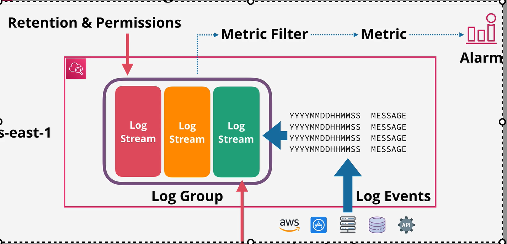

# Cloud watch log
    public service: we can use it on AWS and on-premise
    Store , Monitor, and access logging data
    AWS Integration:
        Ec2 , VPC Flow logs , Lambda , Cloudtrail
    we can generate metric base on log

