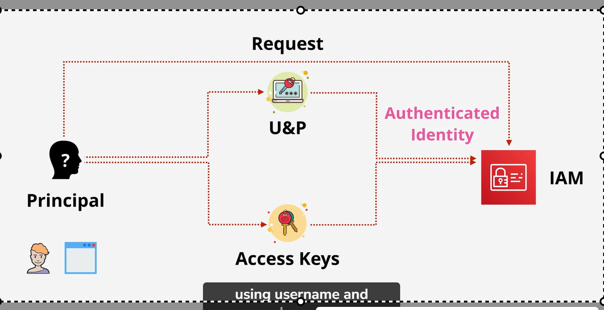
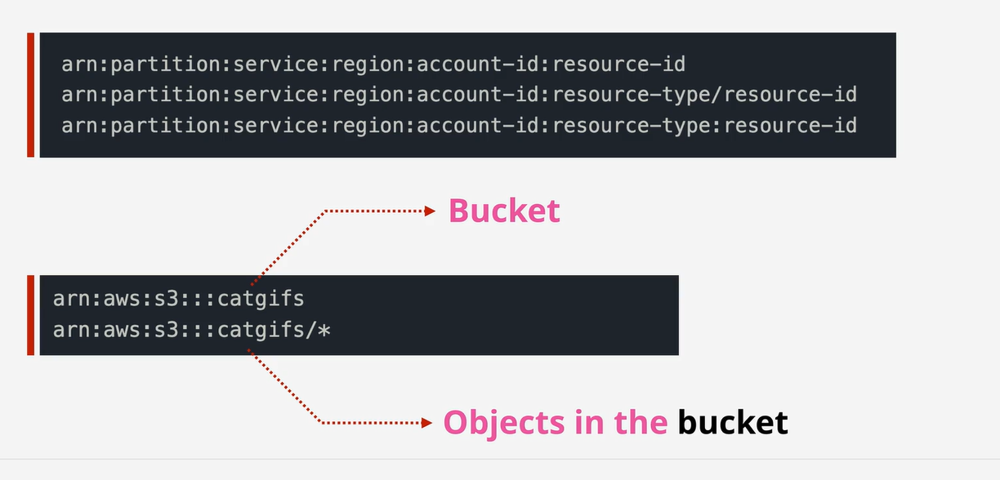
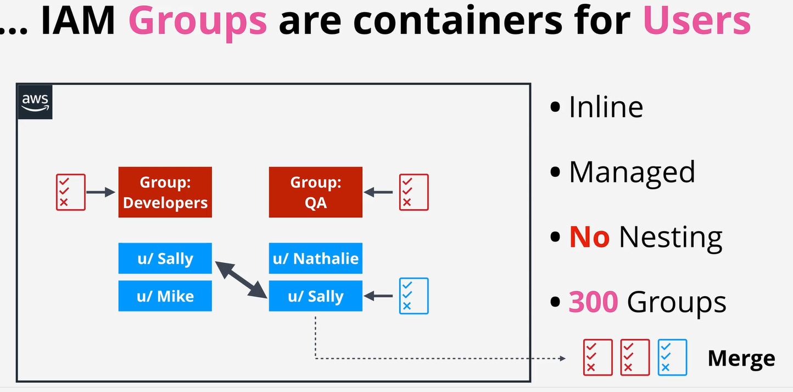
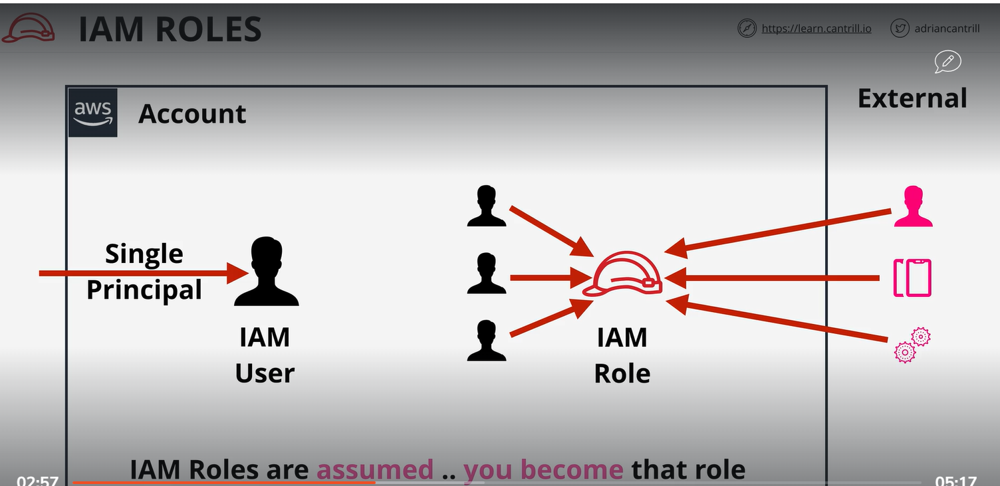
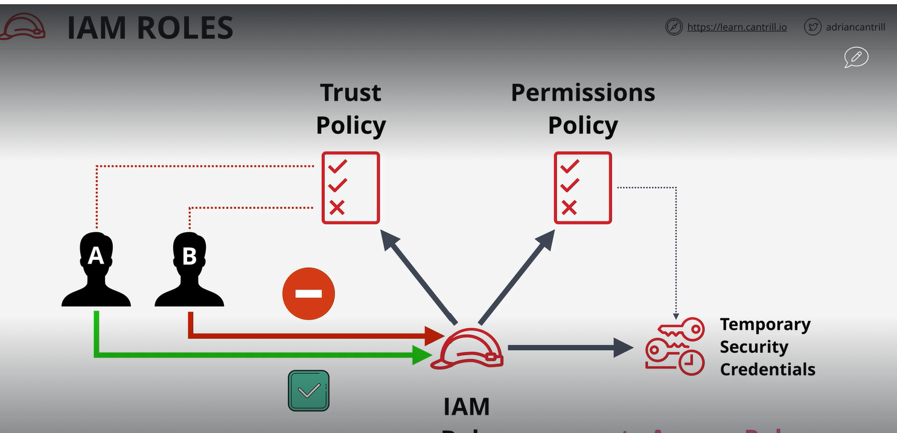
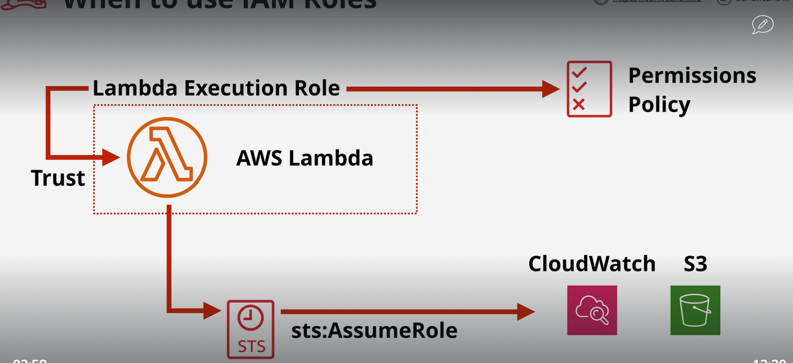

# IAM user 
    IAM user are an identity use for anything to get long term AWS access. It
    could be Human or machine  or  other Account

# Principle:
    Principle could be a person or application. If it need to access resources it need to get authenticate againt IAM.
# Authenticate
    Human or application need to authenticate before using AWS console. It can authenticate using password or Access key
# Authorize
    In autorizing IAM checking  the statement the apply to identiy it allow or deny.


# Amazon Resource name
    Uniqure resource within AWS account.

```
    arn:aws:s3:::mybucket          In this mean you get bucket permession

    arn:aws:s3:::mybucket          In this mean you get object in bucket 
    ```


# Intresting fact
    1 you can have 5000 IAM user
    2 I am user can be member of 10 group
    3 
# IAM Group
    IAM group is a container of IAM users. You can not login into group


# Role
    Role is a identity. like multiple user inside or out side AWS account use as identity. 
    ``` 
        IAM role are assumed ... that you become that role for short period of time
        ````



Difference between IAM user and IAM role
    we use IAM user to login into our AWS account. User have attach inline or  managed policy.
    In IAM role have 2 type of policy. 
        1 trust policy
            It mean which identity consume that role.

        2 permession policy



#   When to use IAM role

    AWS Lambda 


    Explanation:
        when we create lambda we have to create a execuation role. which has 1 trust policy mean we trust this lamnda and permession policy mean what permession we are allowing to this lambda.
        lambda create a token using STS assume role for certain period of time
