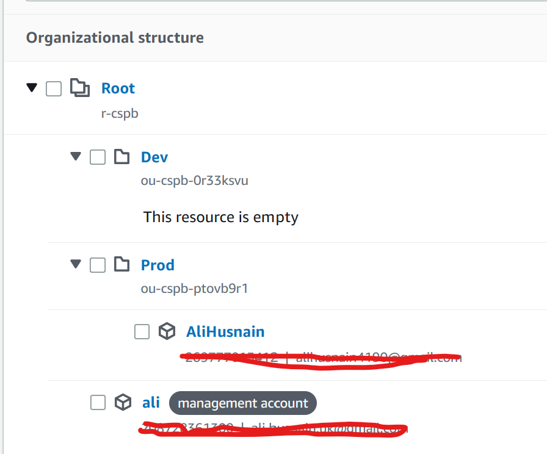

# AWS organization
    you use single AWS account to handle all other account billing (consolidate billing)
    you will get volume discount
    you can also create and invite new account.
    
    This is also called managment account or Main account
    We have organization of root and inside we have multiple organization unit.

Create a organization.
    Add 2 OU number 1 Prod 2 Dev
