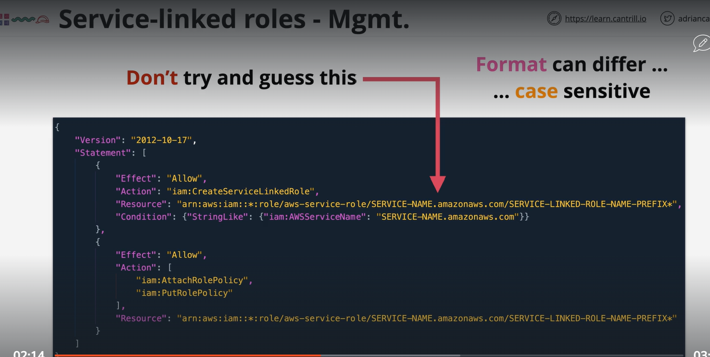

#Service linked role
    A service-linked role is a unique type of IAM role that is linked directly to an AWS service. Service-linked roles are predefined by the service and include all the permissions that the service requires to call other AWS services on your behalf. The linked service also defines how you create, modify, and delete a service-linked role. A service might automatically create or delete the role

    
# NOTE
Remember that service roles are different than service-linked roles. A service role is an IAM role that a service assumes to perform actions on your behalf. An IAM administrator can create, modify, and delete a service role from within IAM. For more information, see Creating a role to delegate permissions to an AWS service in the IAM User Guide. A service-linked role is a type of service role that is linked to an AWS service. The service can assume the role to perform an action on your behalf. Service-linked roles appear in your AWS account and are owned by the service. An IAM administrator can view, but not edit the permissions for service-linked roles