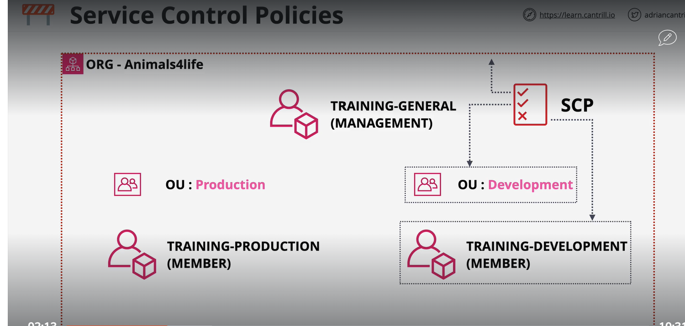

# Service control policy
    SCP can attach to organization.
    It also can attach to managment account
    It also can attach to seperate OU (organization unit)

SCP is a account permession boundry which mean what AWS account can do.
SCP do not allow grant any permession.
SCP is only define what is allow and what is not.
