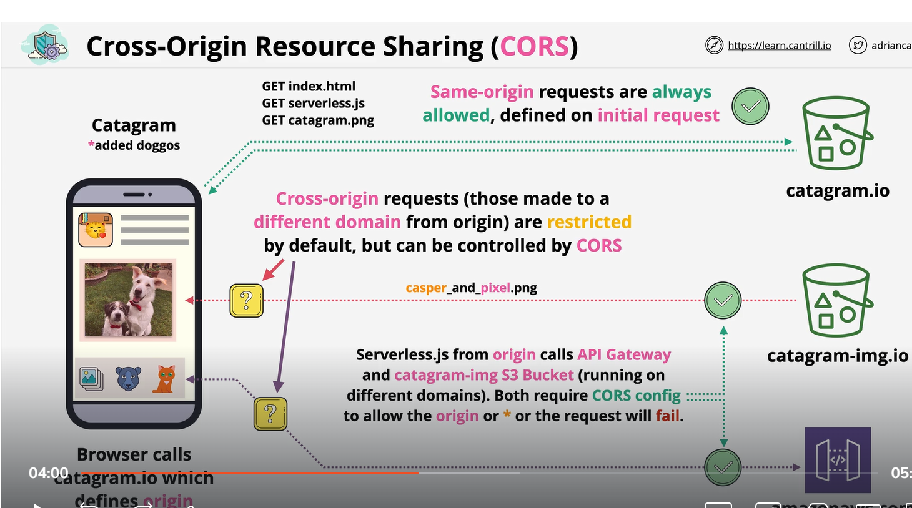
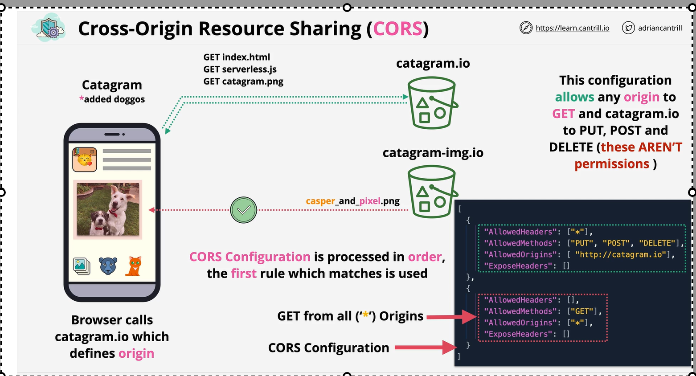

# CORA()
    Cross-origin resource sharing (CORS) defines a way for client web applications that are loaded in one domain to interact with resources in a different domain. With CORS support, you can build rich client-side web applications with Amazon S3 and selectively allow cross-origin access to your Amazon S3 resources.

Simple request
