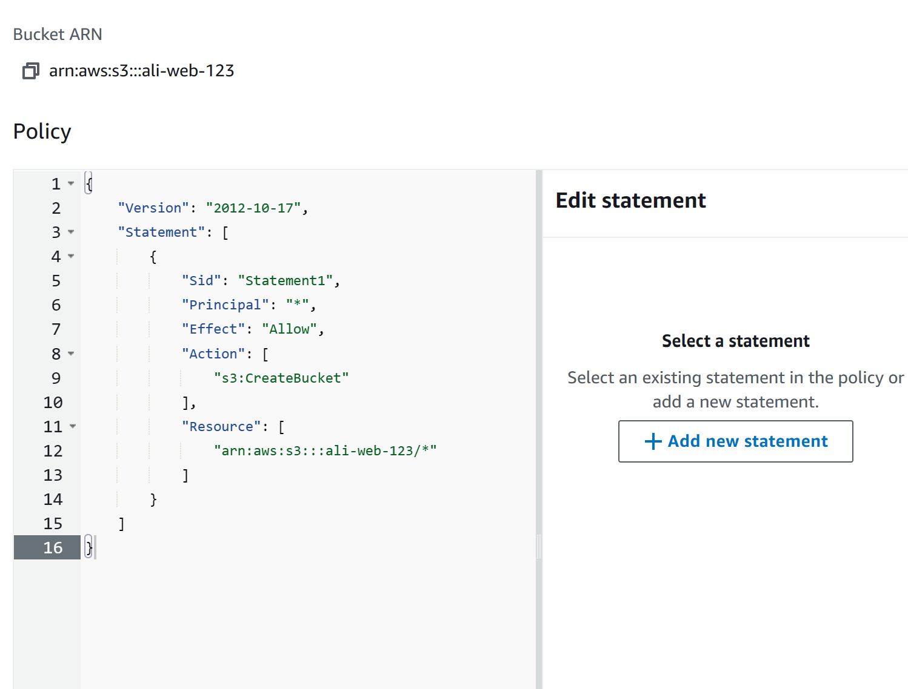
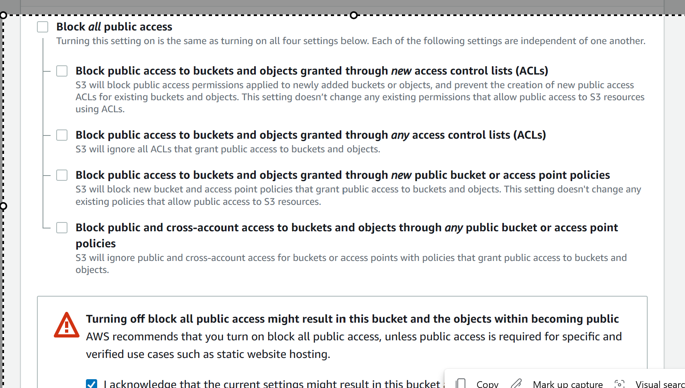
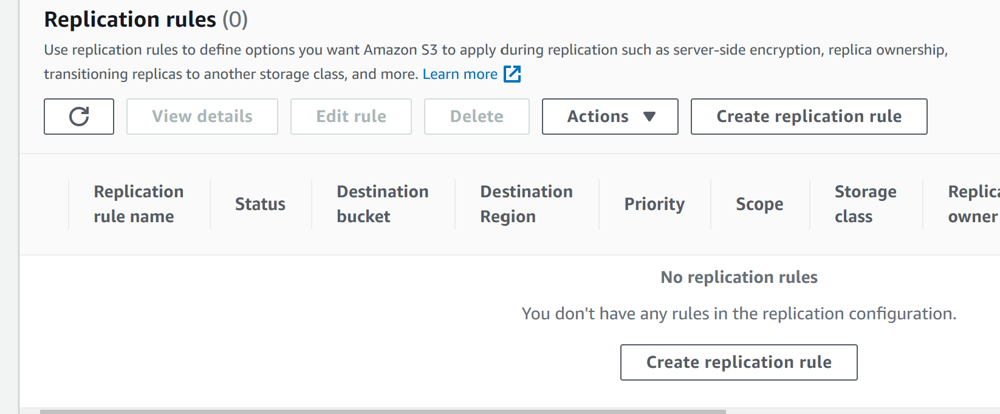
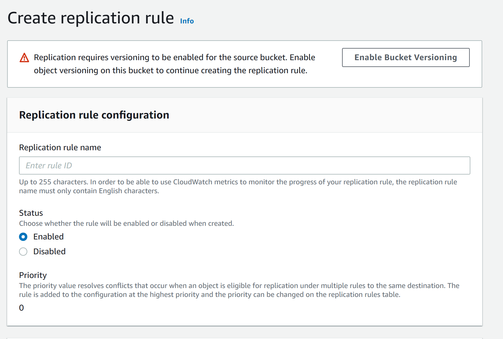
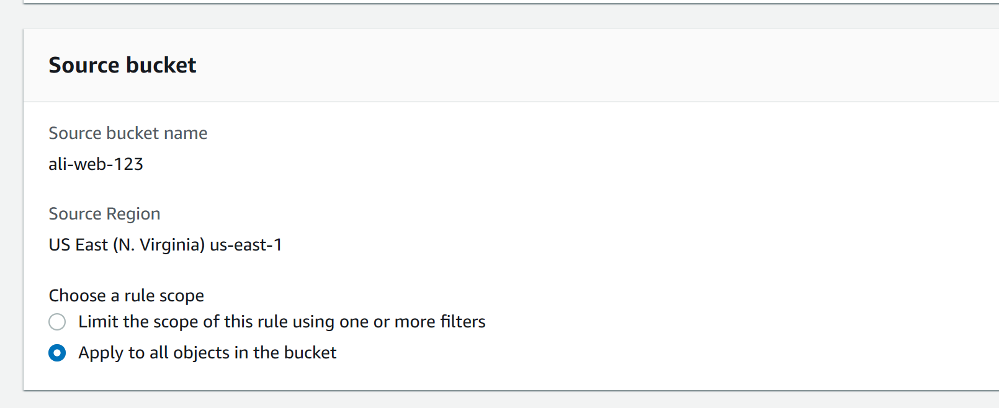
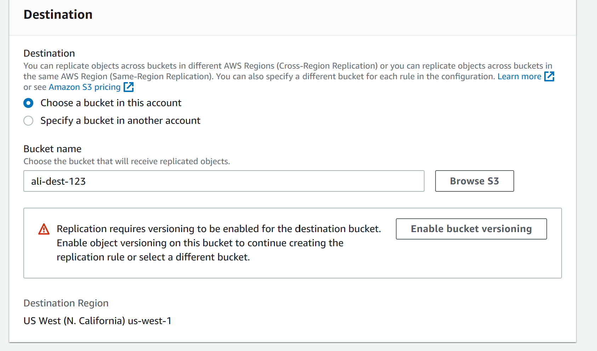
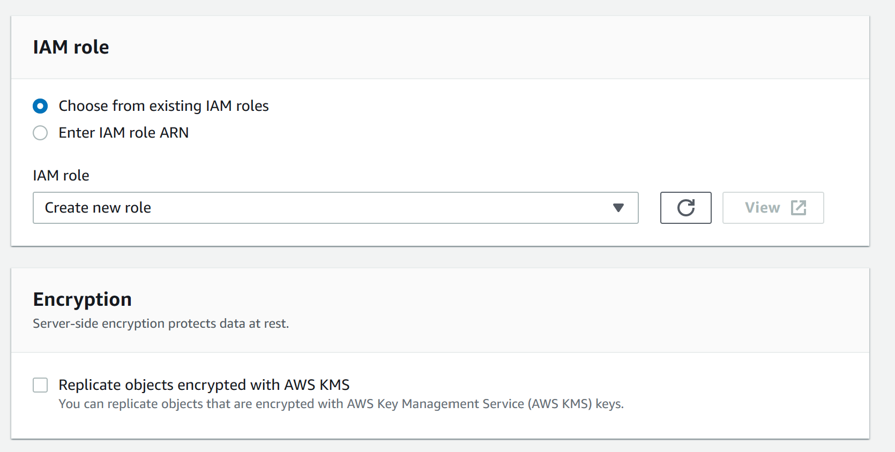
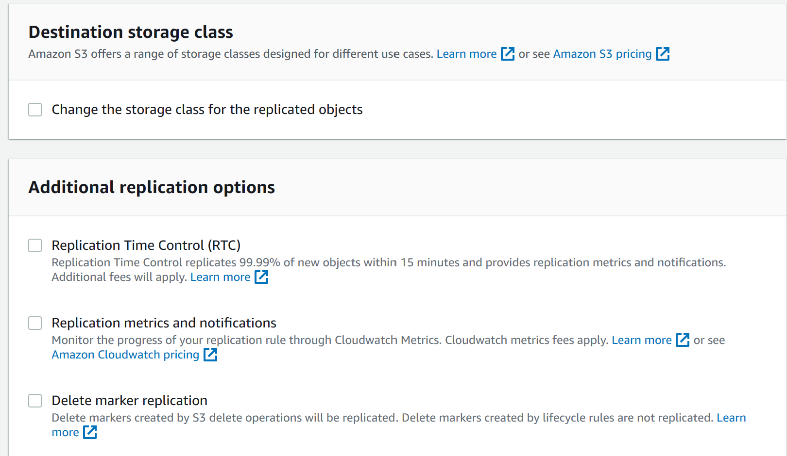

Step 1 :
    Create a bucket with default setting in verginia region
step2:
    Enable static website and disable public access check after go to permission tab.
    To make it public we need to add bucket policy. policy is in below
    . NOte it is not createBucket. ACtion is GET object.
NOTE: /* mean anything with in bucket.
    You will see bucket is public in red sign


Step 3:
    NOW create destination bucket, select region for destination bucket. with uncheck public access and click checkbox I acknowledge it. and all way botton click create it.


Then enable static website . and edit bucket policy. Then make object public for that set bucket policy like we have done above other bucket.
```
{
    "Version": "2012-10-17",
    "Statement": [
        {
            "Sid": "Statement1",
            "Effect": "Allow",
            "Principal": "*",
            "Action": "s3:GetObject",
            "Resource": "arn:aws:s3:::ali-dest-123/*"
        }
    ]
}
```

# Step 5
    Enable cross replication For that go to managment in source bucket (ali-web) and  click replication rule

For replication rule we need to enable bucket version. 

Select which object or whole bucket object want to replicate


After create rule give destination bucket.


Create new or existing rule

you can also set RTC(replication time control and bucket storage class)



