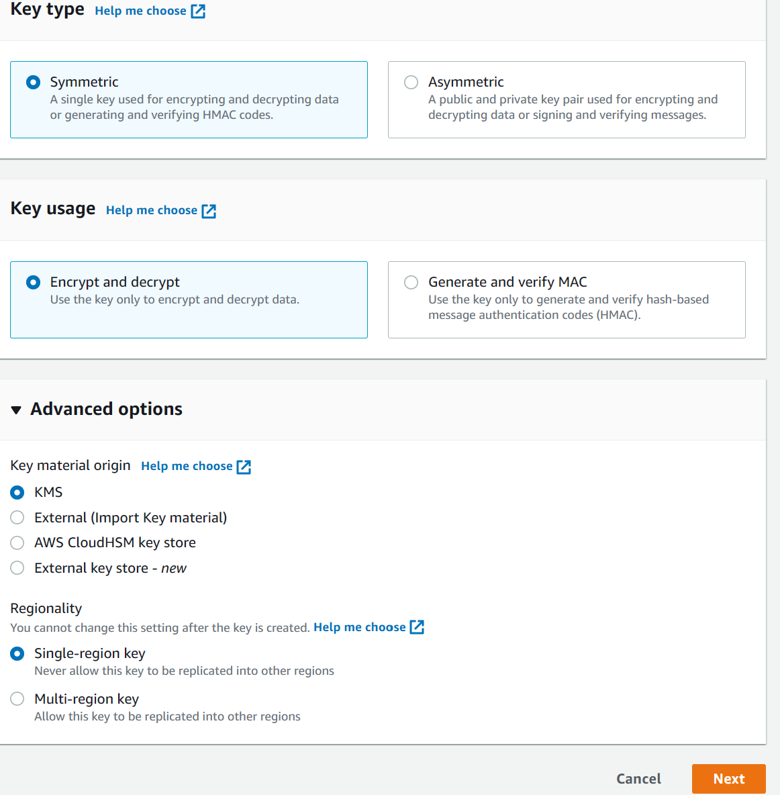
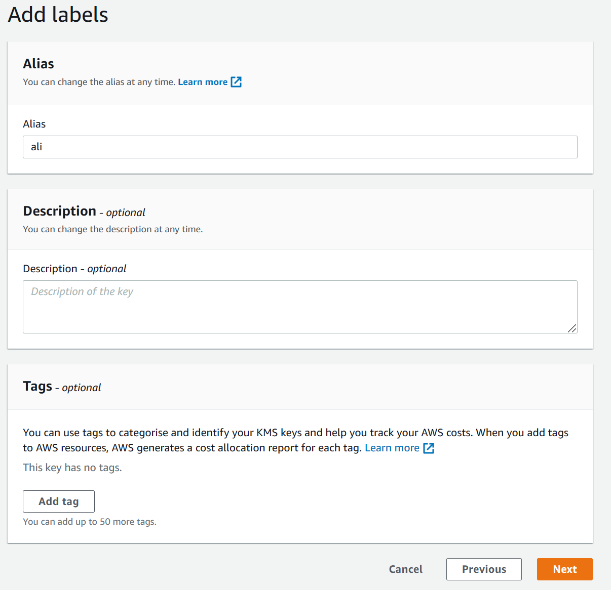
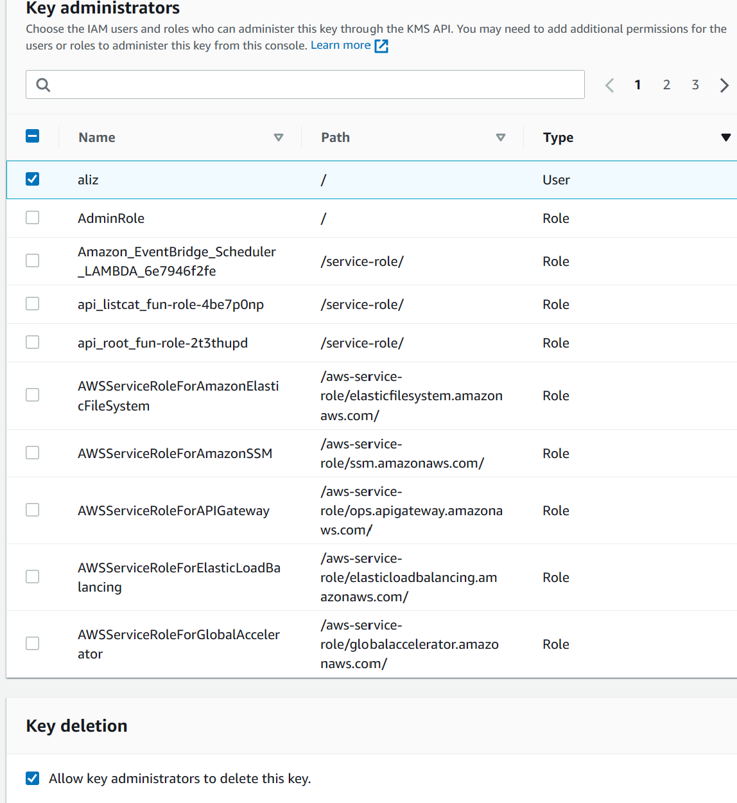
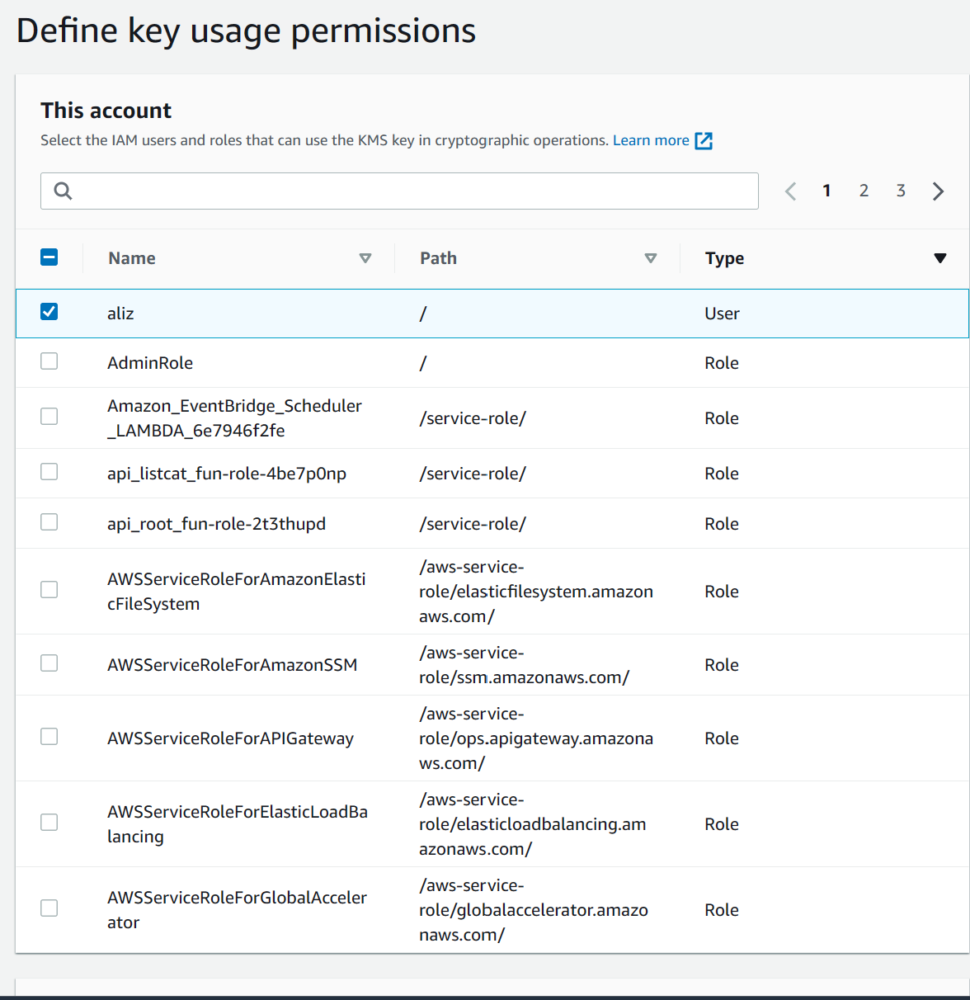

# Step 1 
    Go To KSM service and select 

# Step 2 
we can creaa te alias

# Step 3 
we are defining who is going to manage key select and click next


# step4 

# step4

run local shell 

```
echo "find all the doggos, distract them with the yumz" > battleplans.txt

aws kms encrypt \
    --key-id alias/catrobot \
    --plaintext fileb://battleplans.txt \
    --output text \
    --query CiphertextBlob \
    | base64 --decode > not_battleplans.enc 


    aws kms decrypt \
    --ciphertext-blob fileb://not_battleplans.enc \
    --output text \
    --query Plaintext | base64 --decode > decryptedplans.txt

```


In incrypt command we have to give key but for decrypt we do not need to give key id we just need to give ciphertext .

