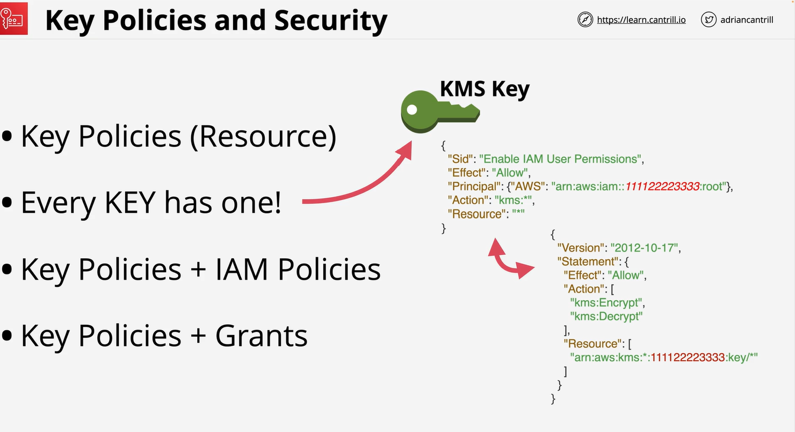

# KMS  (key manangemnet service)
    1 It is regional and Public service 
    2 It create , store and manage key
    3 KMS manage symetric key and Asymetric key
    4 it also use to perform cryptography operation(encryptm decrypt)
    5 Key never leave KMS = Provide FIPS 140-2 L2   

# KMS key:
    1 KMS key are logical = ID, data, policy decription and state
    2 baked by physical metrial
    3 It can be generate and imported
    4 KMS key can be used up 4kB of data

# Data Encryption Key
    1 GenerateData key : we use this one if we have data more then 4KB

# Key concepy:
    1 KMS key is isolated in region and never leave
    2 it is owned by AWS or cutomer
    3 Customer manage key are more configureable.
    4 KMD support key rotation 

# Key polices and security
    Key polices (resources)
    Every key has one KMS key
    Key policies and IAM polices
    Key policies + Grants
