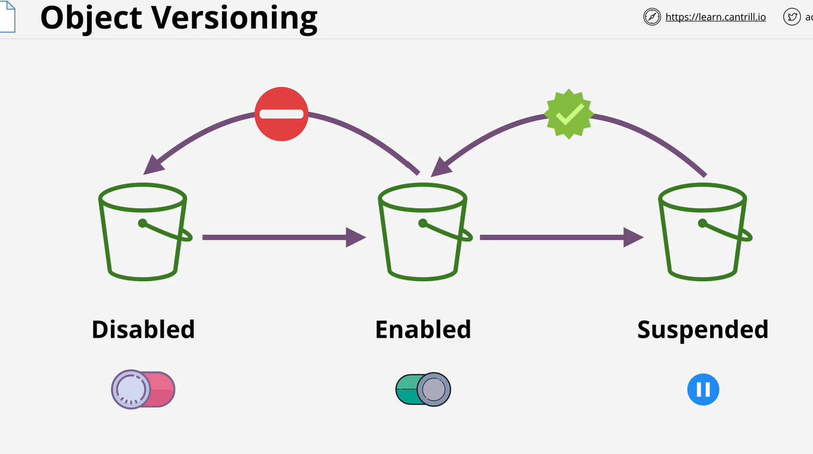
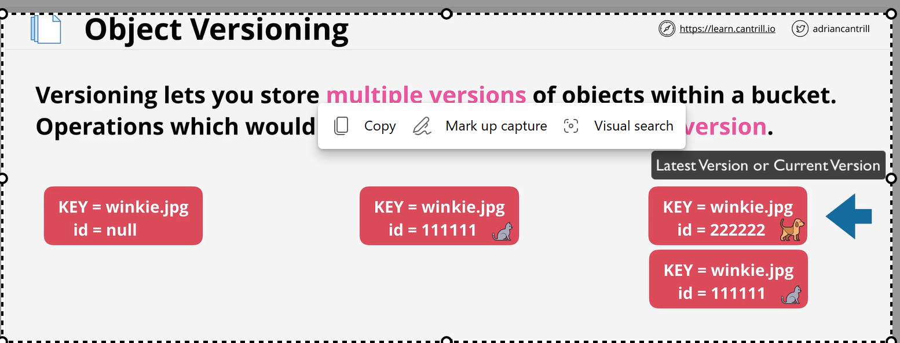
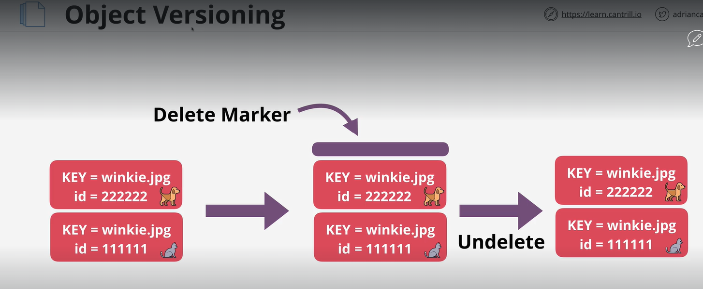
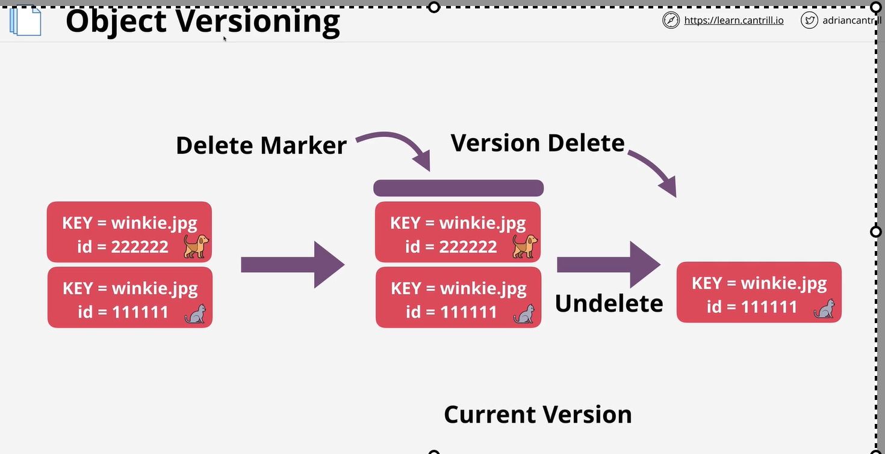

# Object version
    objet version work on bucket level
    you can not disable bucket after enable it. you can suspend but when you need you can enable it agian.
    

    Versioning let you to store multiple version of object within bucket. 
   
    When version is disable Id of bucket is NULL
    

    Delete Image:
        If you have a version enable and you delete it will make a latest image as a delete marker . If you delete the delte marker then image become active again. 

When you delete latest delte marker then previous version become latest. below image explain

NOTE:
    you are billable for all version. 
    Only way to 0 cost delet the bucket.

# MFA
    Enable in versioning configration
    MFA is require to change bucket version
    MFA is require to delete bucket.
    