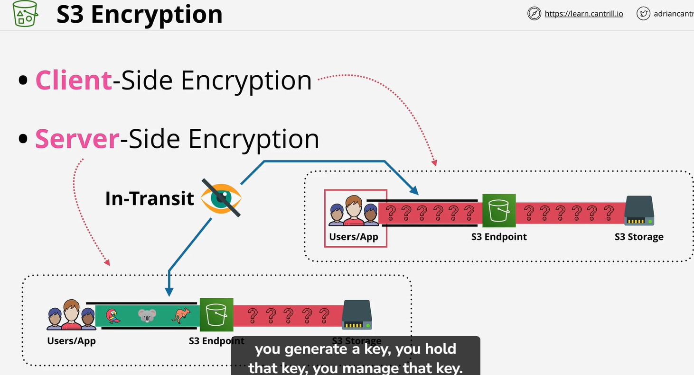
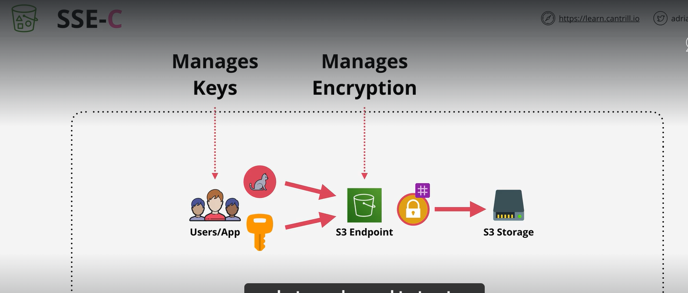
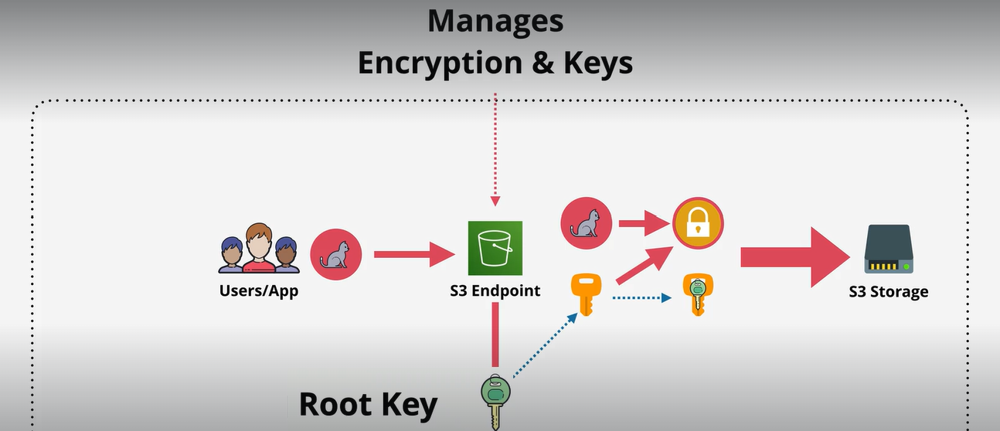
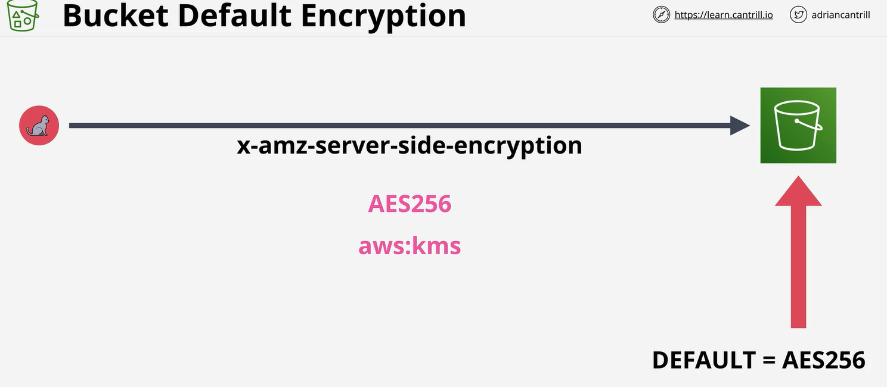

# S3 Encryption
Bucket are not encrypted. 
    Client side encryption
    Server Side Encryption
Above both work on data at rest

# we have 3 
    Server side encryption with customer provided keys(SSE-C)
    Server side encryption with Amazon S3 Managed keys(SSE-s3)
    Server side encryption with AWS key management service (SSE-KMS)

# SSE
    When you put object into s3 you need to pass object and key. Object is plaintext at this point.

        ## NOTE!: Remember outside world you data is transfer using HTTPS so it is in scrambled form. But s3 do see original form of data.

        Your object encrypt when they arrive at s3 endpoint. Hash is taken of the key and then key dicard . Then object and one way has store in S3 storage. 

        To decrypt object you need to provided s3 which object you want to decrypt and key. S3 compare hash if it match then s3 decrypt data and descard key and return you your data.

        Benifit of SSE:
            you will control of your SSE key
            Same amount on CPU enviourment
  
    

# SSE- S3(AES 256)
    In this method AWS handle both encryption and decryption of object.
    When object upload to s3 each object encrypted using S3(AES 356 ) key. The way it work S3 generate key for each object. The use it key to encrypt that object . Then root key use to encrypt that key then orignal version of key discarded. we left with ciphertext or encrypted key. Both store side by side on s3 storage.

    Benifits:
        AWS handle decryption or encryption
        Root key is out of your control
        Individual key also out of your control

# SSE - KMS

# Default encryption at Bucket
    If you do not spacifu anything it take S3-AES256    
