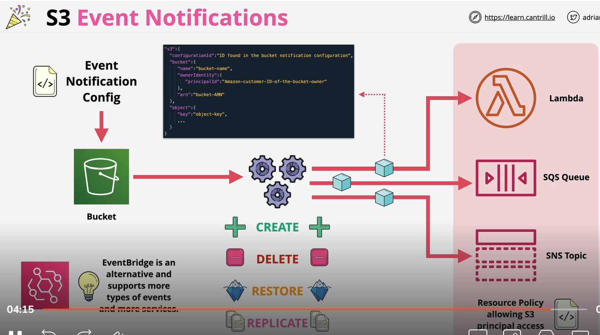

# S3 Event:
    The Amazon S3 notification feature enables you to receive notifications when certain events happen in your bucket. To enable notifications, you must first add a notification configuration that identifies the events you want Amazon S3 to publish and the destinations where you want Amazon S3 to send the notifications. You store this configuration in the notification subresource that is associated with a bucket

    1) Notification create when object occur in bucket.
        ... can be deliver to SNS, SQS and Lambda
    2) object create (put,post, copy )
    3) object Delete(*, delete, Delete marker created)
    4) Object Restore (POST, complete)

