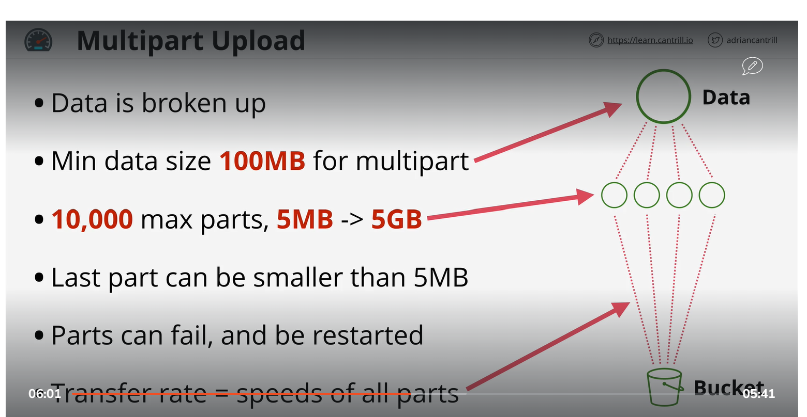

# Single put upload
    When are you uploading any file it fail it mean it all file need to upload again. like If you are uploading file of 5 GB and it fail at 4.50 then you have to upload it agian. which is not good.

# Multi part upload
    if you are uploading file which have more then 100MB size always select multi part upload.

# S3 Accelrate transfer (OFF)
    If you have mulitple team in different region and data of bucket is in different region. When they try to access data it transer on public internet. which is not good. solution is use S3 transfer 

# S3 Accelrate transfer (ON)
    S3 Transfer Acceleration is a service that speeds up, simplifies, and secures file transfers between one client and an S3 bucket.

If you want to enable this feature Go to properties and scrol down select Transfer accelration and enable it.