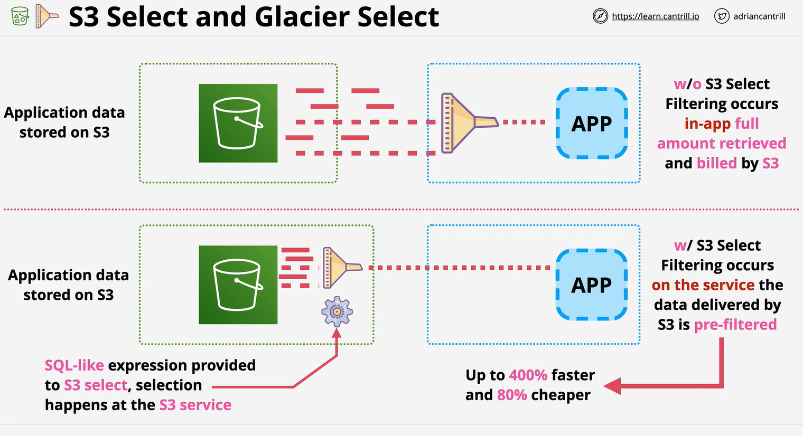

# S3-Select-Glacier-Select
S3 and Glacier Select allow you to use a SQL-Like statement to retrieve partial objects from S3 and Glacier.

    1 S3 can store Huge object (up to 5GB)
    2 you often want to retrive the entire object
    3 Retrive 5GB object ,,, take some time 
    4 Filter at client side does not reduce
    5 S3/Glacier select let you use SQL  like statement 
    6 .... to select let you use SQL like statement
    7 CSV, JSON, BZIP2 comparison , Parquet, for CSV and JSON

