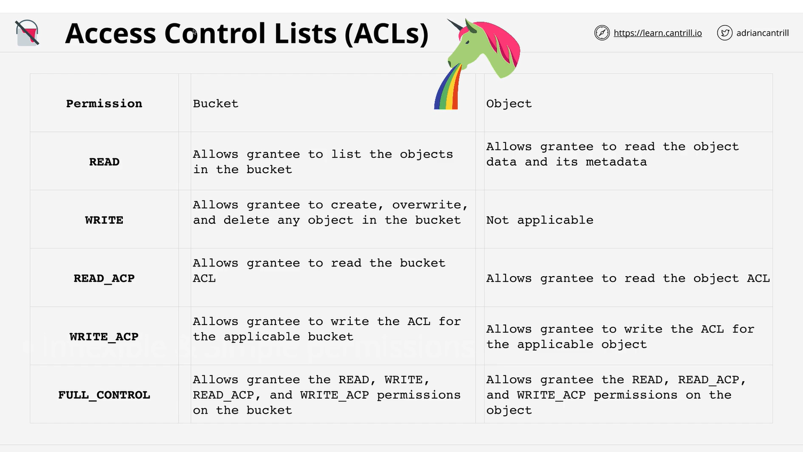
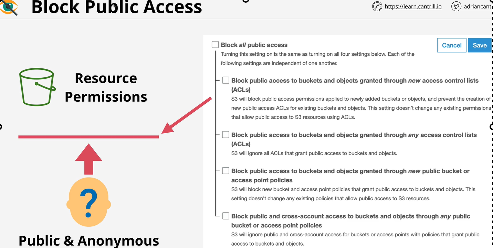

# S3 security
    S3 is private by default.
    
# S3 bucket policies:
    1 Resource policy
        It is like a identity policy but attach to bucket.
# ACL (Access control list)
    ACL on object or bucket
    A subresources

# Block Public Access
