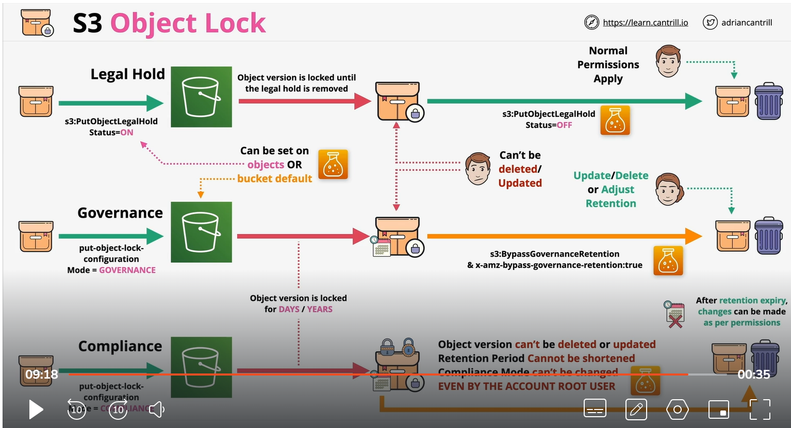

# S3-Object-lock
    1) Object lock is enable on new bukcet.
    2) Now , when you create bucket with enable lock you can not unlock it.  Version is also enable on bucket.
    3) Write once and read Many(WORM), NO Delete and No Overwrite 
    4) requited version, individual are locked
    5) Retention period 
    6) Legal Hold
    
    Two Types of mode
    ##  Retention period
          COMPLIANCE
            1 Specify Days and year , A Retention period
            2 <b>Compliance </b> , can not be adjust, delete or overwrite in duration of retnetion period. Mean no changes to bucket. Even root user can not change. Untill  retention expire
            3 
           GOVERNANCE:
            1 spacial permession can be grant  allowing lock setting can be adjust. In retention period you can not chnage bucket or object. But with GOVERNANCE you can add some permession to change somthing.
                1 ) s3:ByPassGovernanceRetention
                2) x-amz-bypass-governance-retention:true (console default)

    ## Legal Hold:
        1) Set object ON or OFF
        2) no retention
        3) NO Delete or Change  untill removed
        4) s3:PutObjetLegalHold  is required to add or remove
        5) use for prevent accidental deletion of critical object version

    ## Object Lock:

