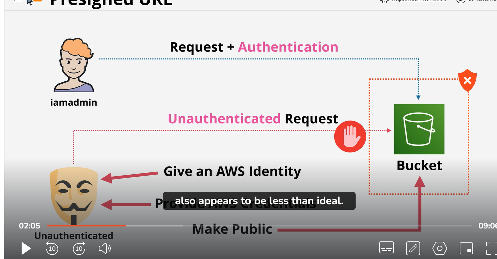
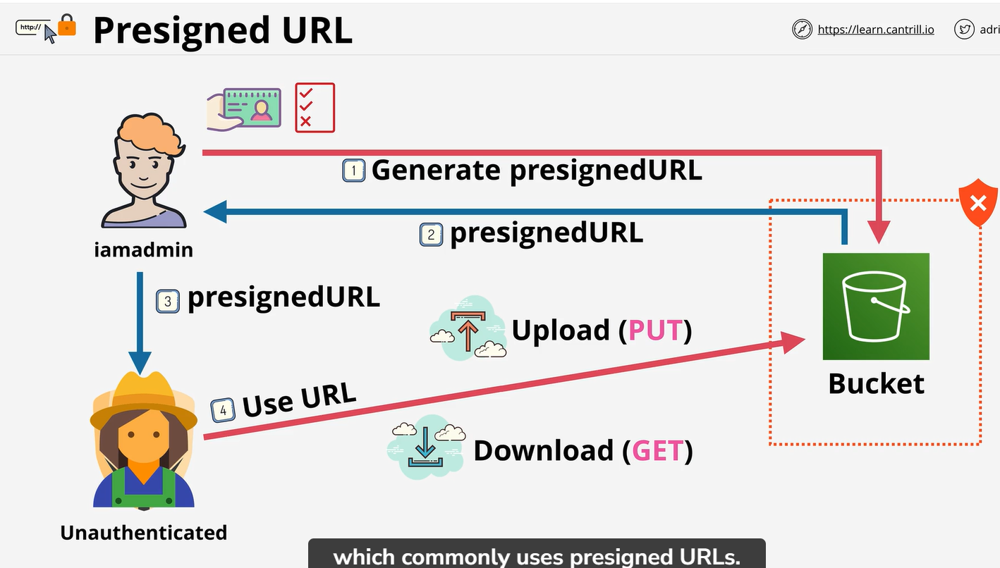
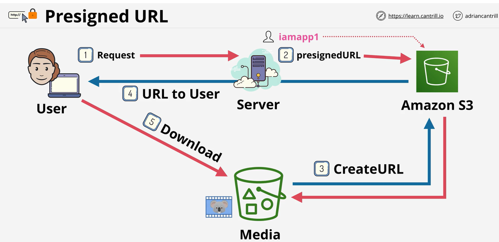

# PreSignedUrl
    Presigned URL's are a feature of S3 which allows the system to generate a URL with access permissions encoded into it, for a specific bucket and object, valid for a certain time period

    To acccess bucket in AWS andmin or people who have permession they can access it . 
    Unathenticate user request will fail. Unathenticate user can access if we give him this way
    1 if bucket is public
    2 Give him AWS credential (security risk)
    3 Give AWS identity
    NOTE (all of above is not good)
    


To handle this situation we have preSignUrl
    So IAM Admin make a request to s3 to generate a preSignURL. Admin need to provide security credential , Bucket and object and exipre data and time.
    Then admin can pass url to unathenticate user.

NOTE:
    PreSignURL can be used to download (get) and upload(put )operation to S3


NOTE:
    we use preSignUrl to acces object from private s3 bucket 


you can create URL even when you have no access
Do not create access with URL because temperarory credential expire


You can create preSignURL from console and CLI

CLI commnad 

```
aws s3 presign object-arn  --expire-in-180
```
