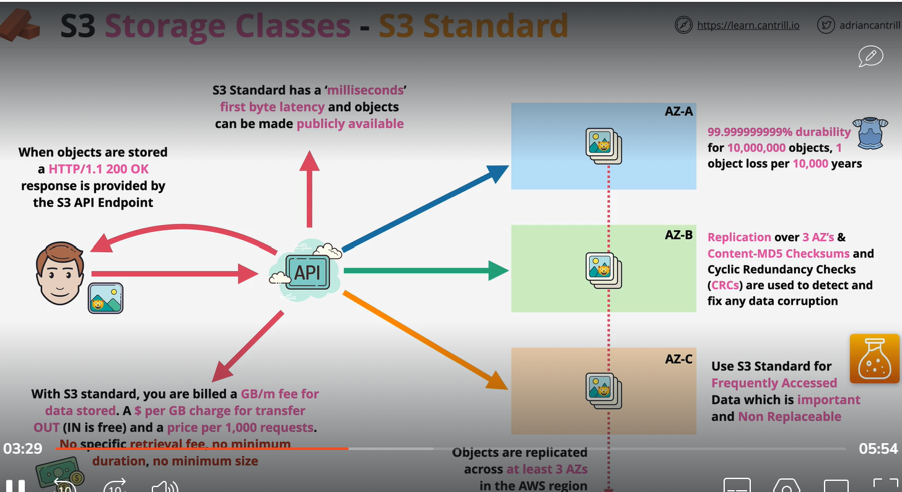
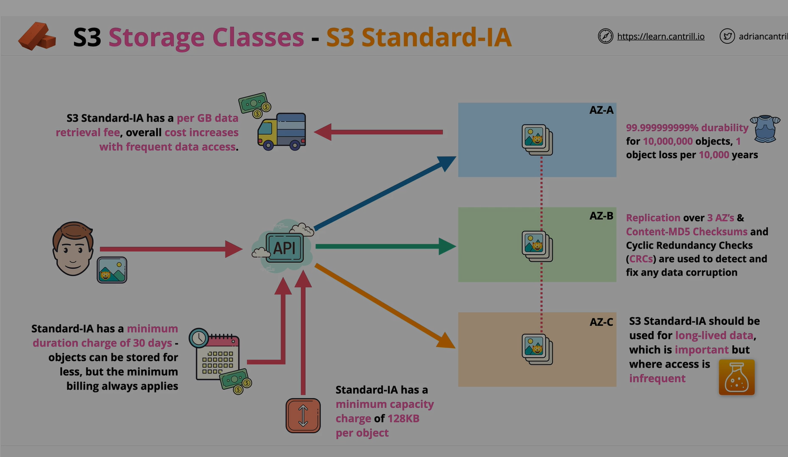
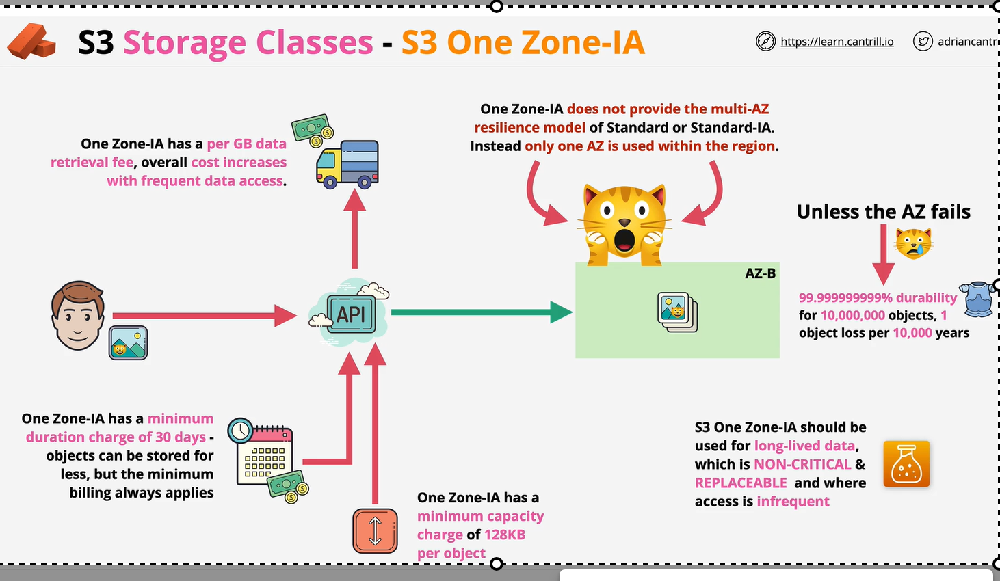
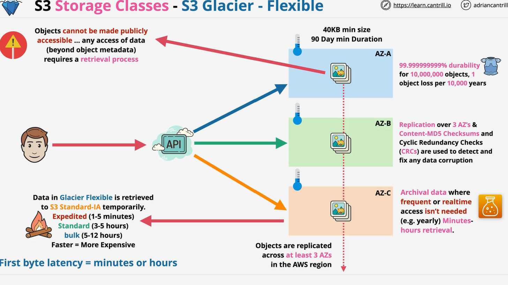
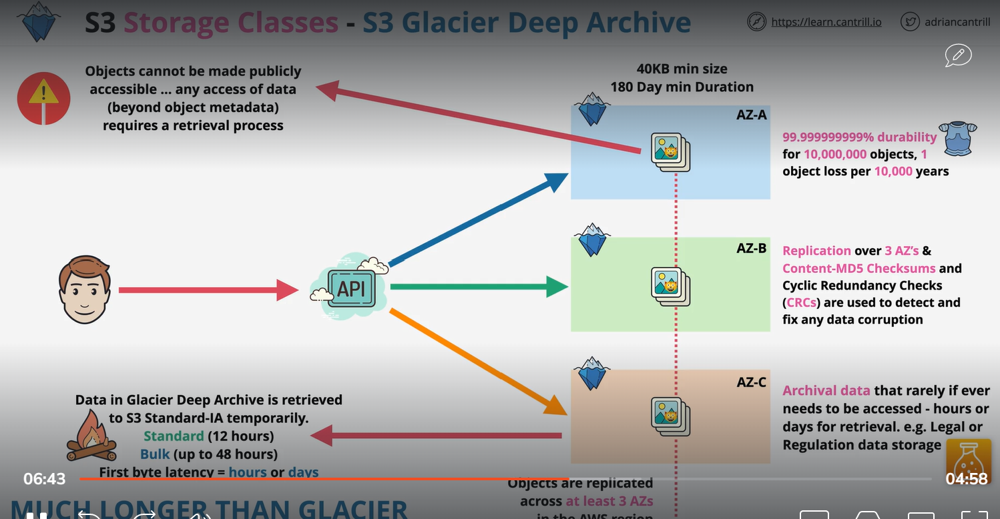
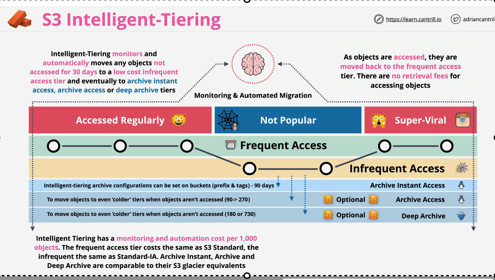

https://aws.amazon.com/s3/storage-classes/

# S3 storage classes -S3 stander
     1 object store at least 3AZ in AWS region.

# S3 Standered IA
    S3 Standered IA we use for long term data which is importent and but access is infrequent.

# s3 storage class: one zone IA
    It is good for long live data which is NON crital and replaceable.

# s3 storage class, S3 Glacier Instant 

# s3 storage class: S3 Glacier flexible

# S3 storage class: S3 Glacier Deep archive
    It is suited for long term data archive . 
    Archive data if you need to access it take hours or days to retrival

# S3 Intellient tier:

