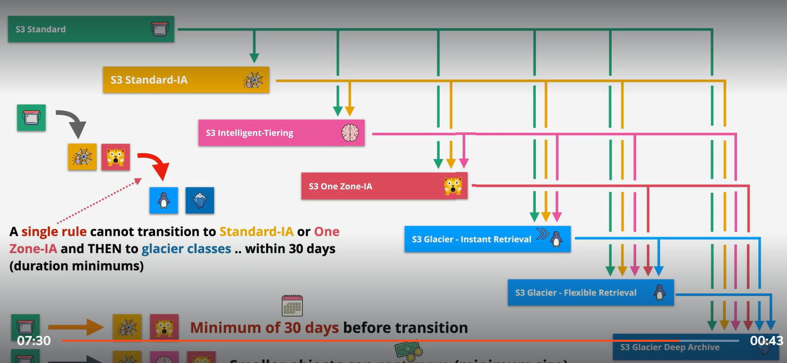

# S3 life cycle rule:
    A lifecycle configration is a set of rule
        Rule consist of action on a bucket or group of object
            Transition action:
            Expiration action:
    Transition action:
        1 beware of when you transfer object from stander ,to Infrequent to one zone IA
        2 Need to remember we have 30 days of remain period s3 object need to remain 
            in stander . Before moving to infrequent or other classess
        3
        