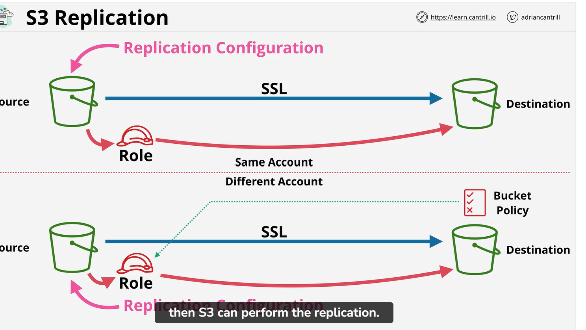
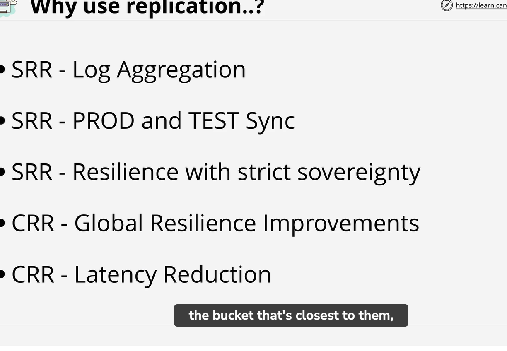

# S3 Replication 
    it is a way which allow to replicate object between source bucket to destination bucket within different account or same account.
    ## Cross-Region Replication (CRR) is the process used when Source and Destination are in different AWS regions
        Explanation:
            with in same account both bucket owned by one AWS account. Both bucket trust IAM service. which mean both trust IAM role. Which mean source and destination bucket as long as role permession policy grant the access.

    ## Same-Region Replication (SRR) is used when the buckets are in the same region.
        Explainnation:
            In different account destination bucket does not trust source bucket. Because they are in different account. Trusted role is not configure in destination bucket.
            For that you have to create bucket policy and which allow role in source bucket account.

    # S3 Replication Options
            What need to replicate?
                first one is all object, prefix or all tag
            You can also select <b> Storage class</b>. You can select cheap class.
            you can also define the ownership of bucket. if bucket in same account then owner would be same. But when bucket is in different account . By default destination bucket is owned by sournce bucket account. Which mean destination bucket can not read those object. You can override it and anything created in destination bucjet can be owned by destination bucket.

    # Replication on time control.
        you can see which object is also in queue for replication.
        This RTC is not required if bucket no need to replicate in 15 mint.

    # Replication time considering
        NOT retroactice and versioning  need to be ON
           1  If you enable replication on pair of bucket a source and destination. Only from that point object will going to replicate from source to destination.
            NOTE: If bucket already have object will not be replicate.
            2 For replication both source and destination bucket need to be version enable. Without vesioning replication will not happen
            3 It is One way replication Source to destination
            4 Unencrypted , SSE-S3 and SSE- KMS (with extra config)
                NOTE: replication will not work with SSE-C
            5 If you upload object and you owned that object . But if you grant cross account access to bucket. If you have a resource policy allowing other AWS account to create object in bucket. It is possible source bucket account will not get some of those objet.
            6  No System event, Glacier or Deep Glacier archive
                If any change made in source bucket by lifecycle managemnet they will not replicate to destination bucket, So only user event is replicate .
                Glacier or Deep archive class will not replicate 
            7 DELETE
                by default delete is not replicate between bucket. So adding delete marker . Delete marker will not be replicate. You can enable that but you need to be aware by defualt this is not enable.

    Why we need to use replication?
        For same region replication. you might need to use process LOG Aggregation
            SRR: LOG Aggrigation
                    if you got multiple different s3 bucket which store log for different system. then you could use log into single s3 bucket.
            SRR: PROD and TEST sync
            CRR: Glonal resiliance replication ( have backup of your data in differnt region)
            CRR: latency reduction
