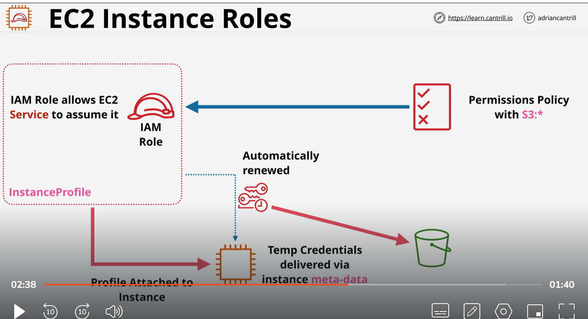

# IAM role for EC2
    
    - credential are inside meta data
    - iam/security-credentials/rolename
    - automatically rotated always valid
    - Use always role rather then adding access key or secret key

`aws s3 ls

curl http://169.254.169.254/latest/meta-data/iam/security-credentials/

curl http://169.254.169.254/latest/meta-data/iam/security-credentials/A4LInstanceRole
`

https://docs.aws.amazon.com/cli/latest/userguide/cli-chap-configure.html#cli-configure-quickstart-precedence