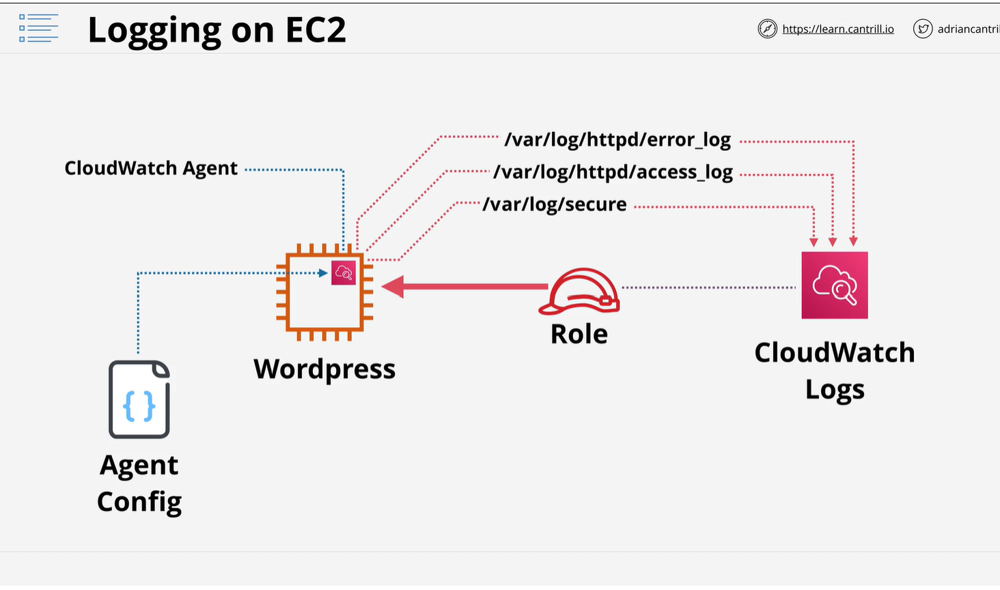

# Loggin on Ec2
    - Cloudwatch for metric
    - Cloudwatch log for loggin 
    - To send log to cloudwatch you need to install agent on Ec2 
    - 

    1 ) install cloudwatch agent on EC2
    2 ) create a IAM role and attach to EC2 (role have permession which send log to cloudwatch)

