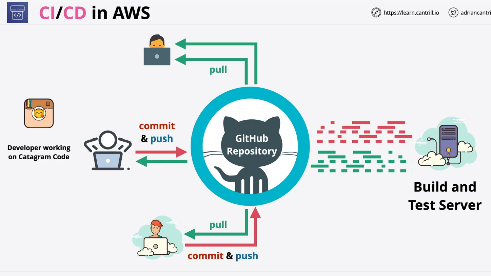
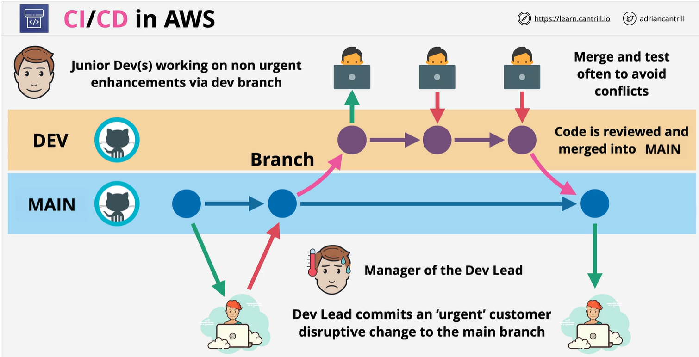
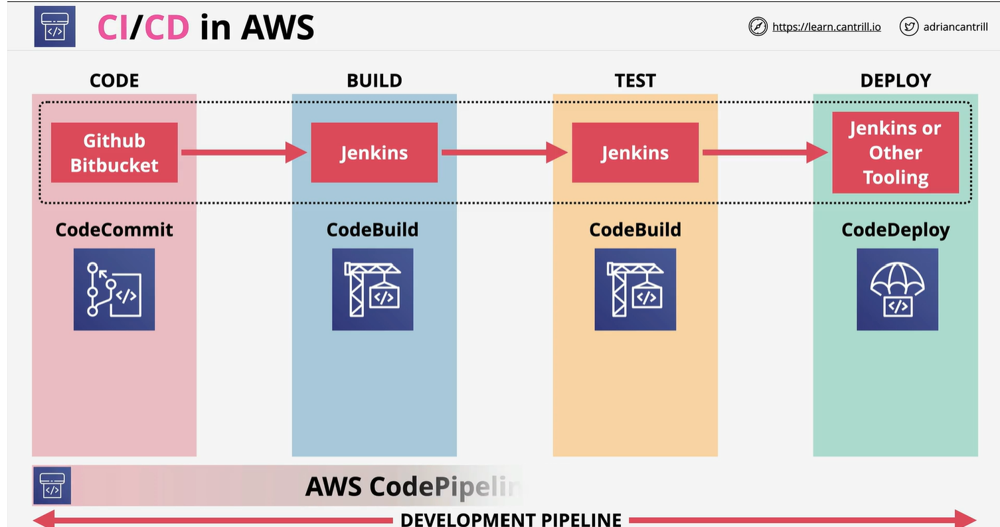
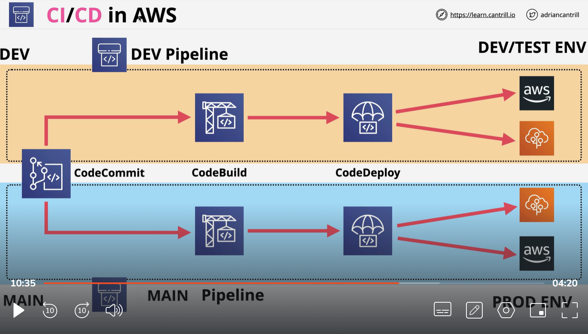

# CICD AWS 
    
    

we  deivede our code in 4 stages
1 CODE:
    IT is actual code. which we create a coding process
2 Build
    Build stage is about building code. Take source code with any libararies , put everything togather to generate a output. 
3 Test
    test the code against varias exepectation.
4 Deplpy
    getting code out and deploy.

The whole this 4 stage is called pipeline. 

# AWS CICD architecture :

