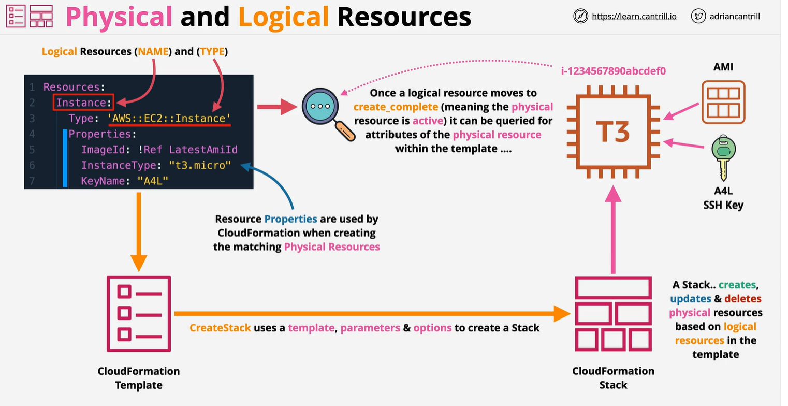

# Cloudformation 
    - Cloudformation template -YAML or JSON
    - Template are used to create Stack , 1 , 2 or 100 in different region
    - If stack template canged , physical resource change
    - If stack is delete normaly physical resource delete

Cloudformation template create a stack , so stack job is to create , update , delete resources, 

