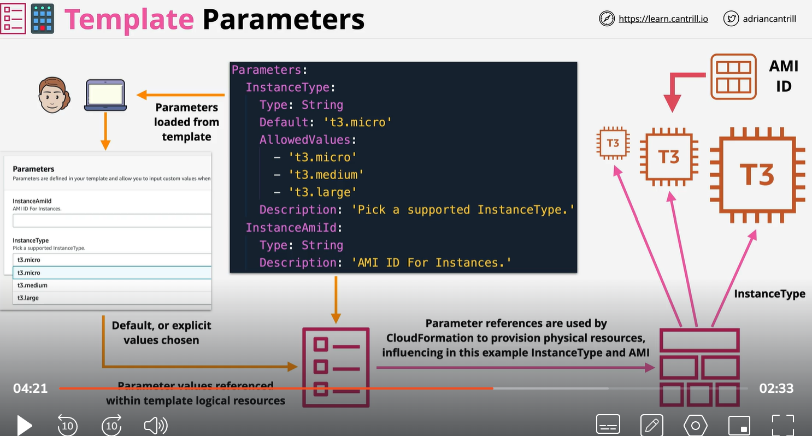

# Cloudformation have two type of parameter

1 ) pseudo parameter 2) tempalate parameter

Tempalate parameter

- Template parameter accept as a input , Console, API, CLI
- Can be configure with Default, Allowed value, Min, Max length, 

Pseudo Parameter:
    1) Pseudo parameters are parameters that are predefined by AWS CloudFormation. You don't declare them in your template. like region, stackId, AccountId, 

https://docs.aws.amazon.com/AWSCloudFormation/latest/UserGuide/pseudo-parameter-reference.html
