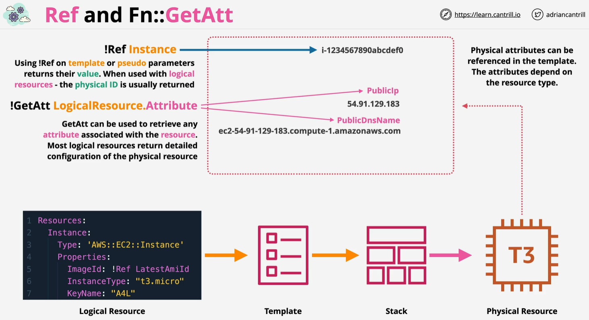
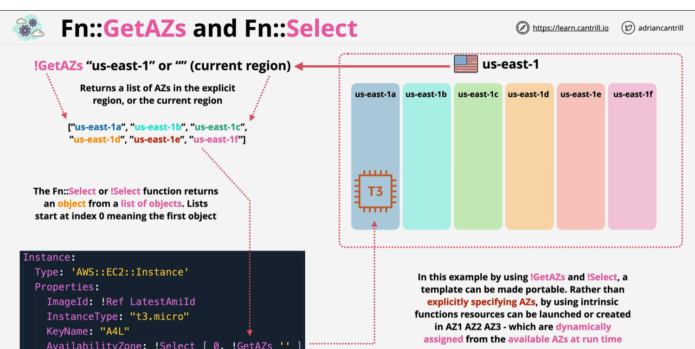
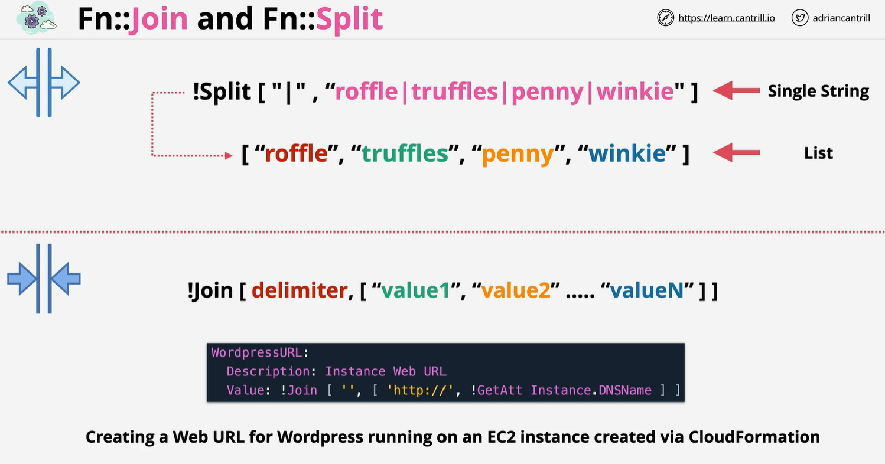

# fn Function
    AWS CloudFormation provides several built-in functions that help you manage your stacks. Use intrinsic functions in your templates to assign values to properties that are not available until runtime.

    - Ref & Fn::GetAtt
    - Fn & Fn::Split
    - Fn::GetAZ & Fn:Select
    - Condition (IF,And , Equal , Not or OR)
    - Fn::Base64  & Fn::Sub
    - FN::Cidr

    https://docs.aws.axmazon.com/AWSCloudFormation/latest/UserGuide/intrinsic-function-reference.html