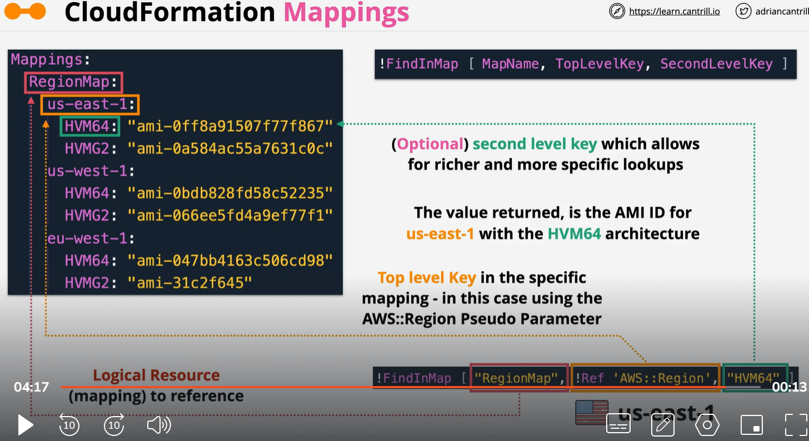

# Mapping

The optional Mappings section matches a key to a corresponding set of named values. For example, if you want to set values based on a region, you can create a mapping that uses the region name as a key and contains the values you want to specify for each specific region. You use the Fn::FindInMap intrinsic function to retrieve values in a map.

