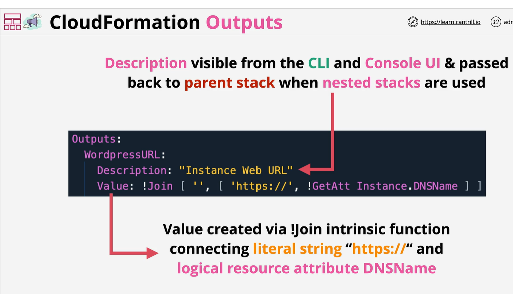

# Output
The optional Outputs section declares output values that you can import into other stacks (to create cross-stack references), return in response (to describe stack calls), or view on the AWS CloudFormation console. For example, you can output the S3 bucket name for a stack to make the bucket easier to find.

