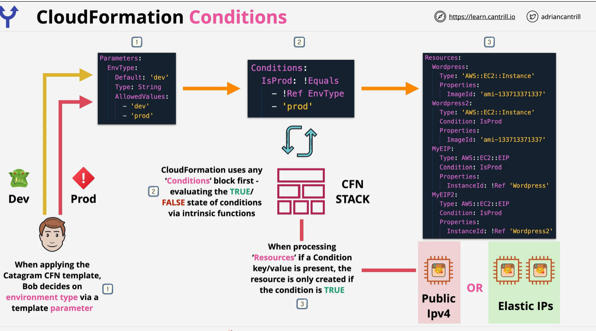

# Condition:
    The optional Conditions section contains statements that define the circumstances under which entities are created or configured. You might use conditions when you want to reuse a template that can create resources in different contexts, such as a test environment versus a production environment. In your template, you can add an EnvironmentType input parameter, which accepts either prod or test as inputs. Conditions are evaluated based on predefined pseudo parameters or input parameter values that you specify when you create or update a stack. Within each condition, you can reference another condition, a parameter value, or a mapping. After you define all your conditions, you can associate them with resources and resource properties in the Resources and Outputs sections of a template

    