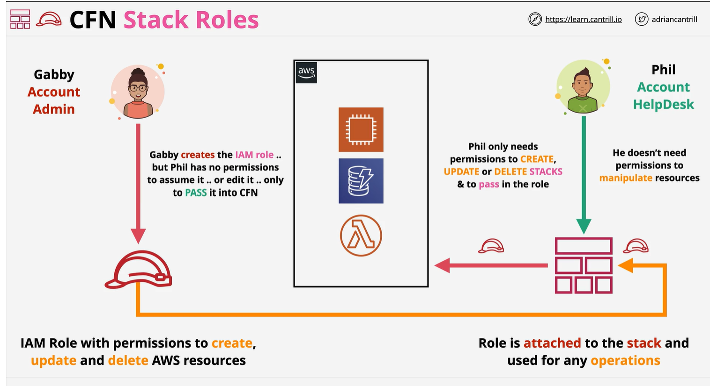

# STACKROLE
    - when you create a stack CFN create physical resources
    - CFN used permession of logged in identity
    - which mean you need permssion for AWS
    - CFN can assume role to gain permession
    - This will let you implement role seperate
    - 
    