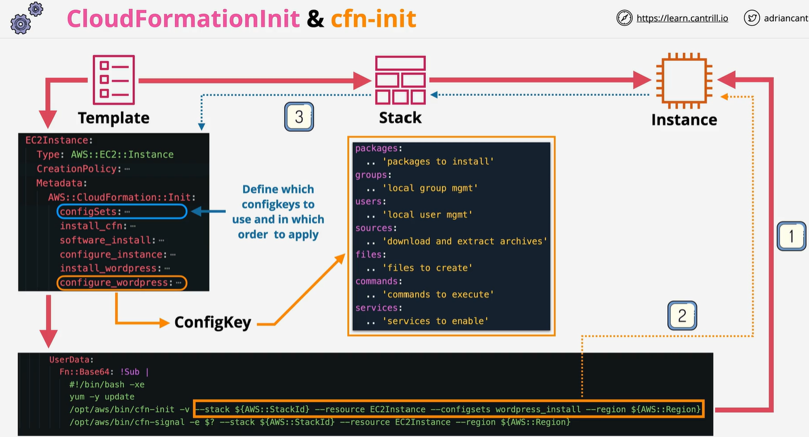
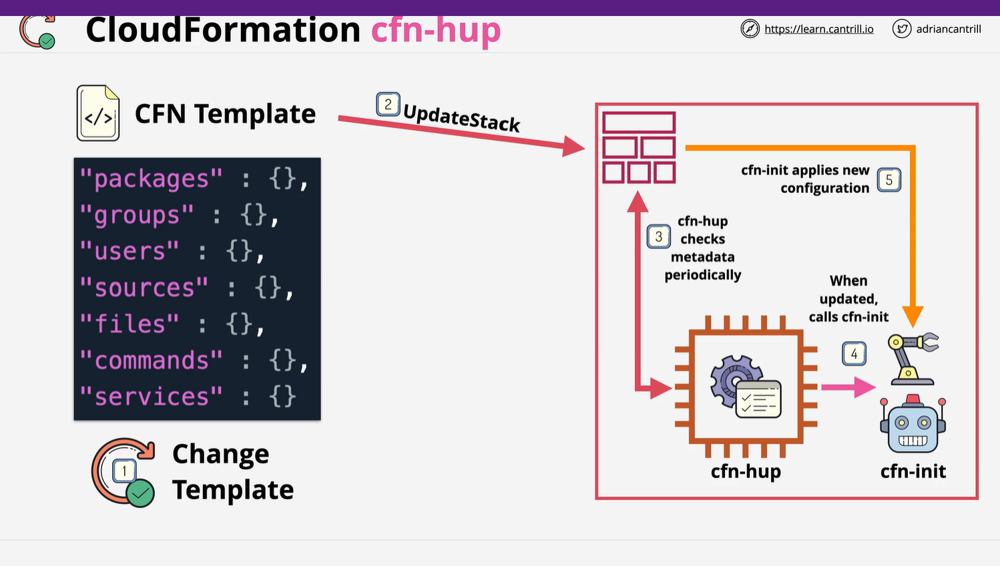

#CFN init
Use the AWS::CloudFormation::Init type to include metadata on an Amazon EC2 instance for the cfn-init helper script. If your template calls the cfn-init script, the script looks for resource metadata rooted in the AWS::CloudFormation::Init metadata key. cfn-init supports all metadata types for Linux systems & It supports some metadata types for Windows

# CFN-hup

The cfn-hup helper is a daemon that detects changes in resource metadata and runs user-specified actions when a change is detected. This allows you to make configuration updates on your running Amazon EC2 instances through the UpdateStack API action.

