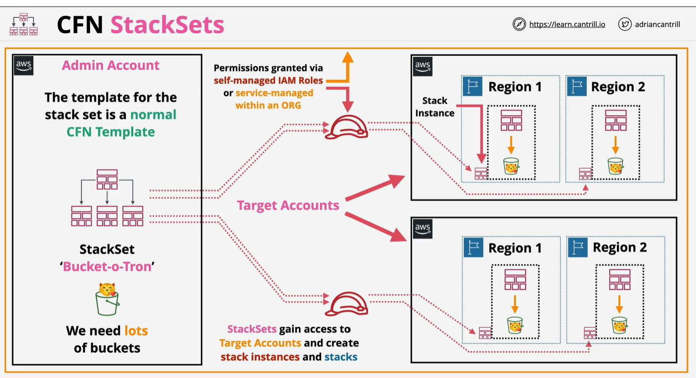

# Stack Set
StackSets are a feature of CloudFormation allowing infrastructure to be deployed and managed across multiple regions and multiple accounts from a single location.

Additionally it adds a dynamic architecture - allowing automatic operations based on accounts being added or removed from the scope of a StackSet.

NOTE StackSet use IAM role or service managed within Org 

Example when to use :
    1 Enable AWS config
    2 AWS config rule, MFA, EBS encryption, EIP
    3 Create IAM role for CRoss account
    