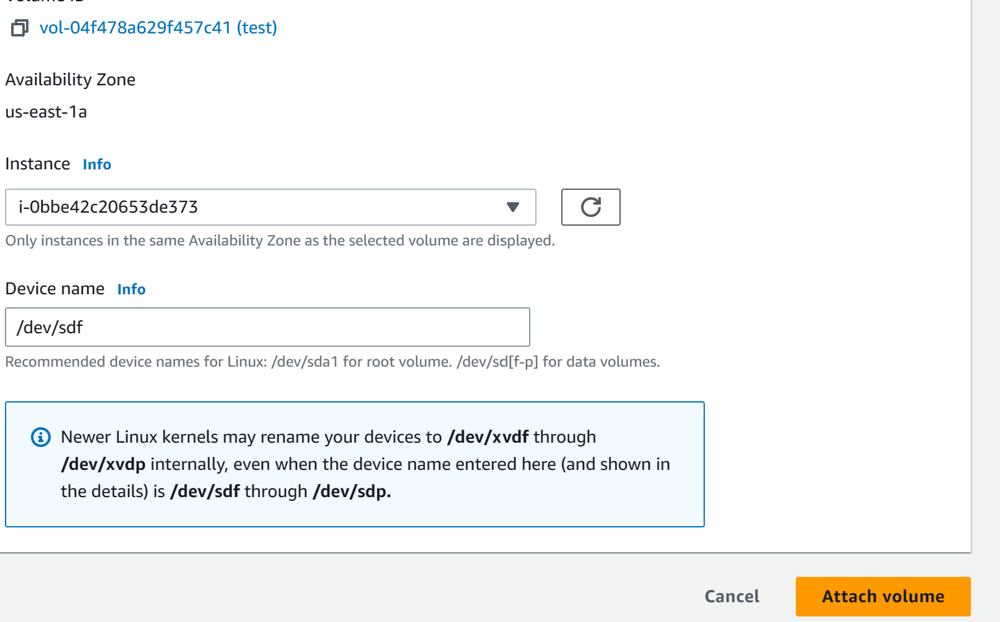

# EBS
    We are going to create EBS volume and mounting to instance.
    Step#1:
        Go to EBS and create volume
            select volume type `gp2` size `1GB`  and for AZ select `us-east-1a` . You can also chose snapshot  and Encrypt that volume using custom manage key or aws/ebs. But these are optional option.
        After EBS available we can attach this to our EC2.
    Step#2:
        Attach to instance
            Select EBS volume and click on action and `attach`.

    
    step#3
        Go to instance 1 in eu-west-1a
            - command need to use
               1: `lsblk` give list of all block
               2: To see if file system of our created blk use this command `sudo file -s /dev/xvdf` if return value is just data it mean it has not any file system. We have to create one.
               3:  file system for our /dev/xvdf use this command `sudo mkfs -t xfs /dev/xvdf`. Need to re confirm re-rerun previous number 2 command
               4:   create a directory to use this command `sudo mkdir /ebstest`
               5: For mount our file which we created to EBs volume need to use this command `sudo mount /dev/xvdf /ebstest`
               6: go created file using this command `cd /ebstest` and create one file `sudo nano amazingtestfile.txt` add some text line there. and save it
               7: To verify it use ls -al
               8: rebbot instance ` sudo reboot`