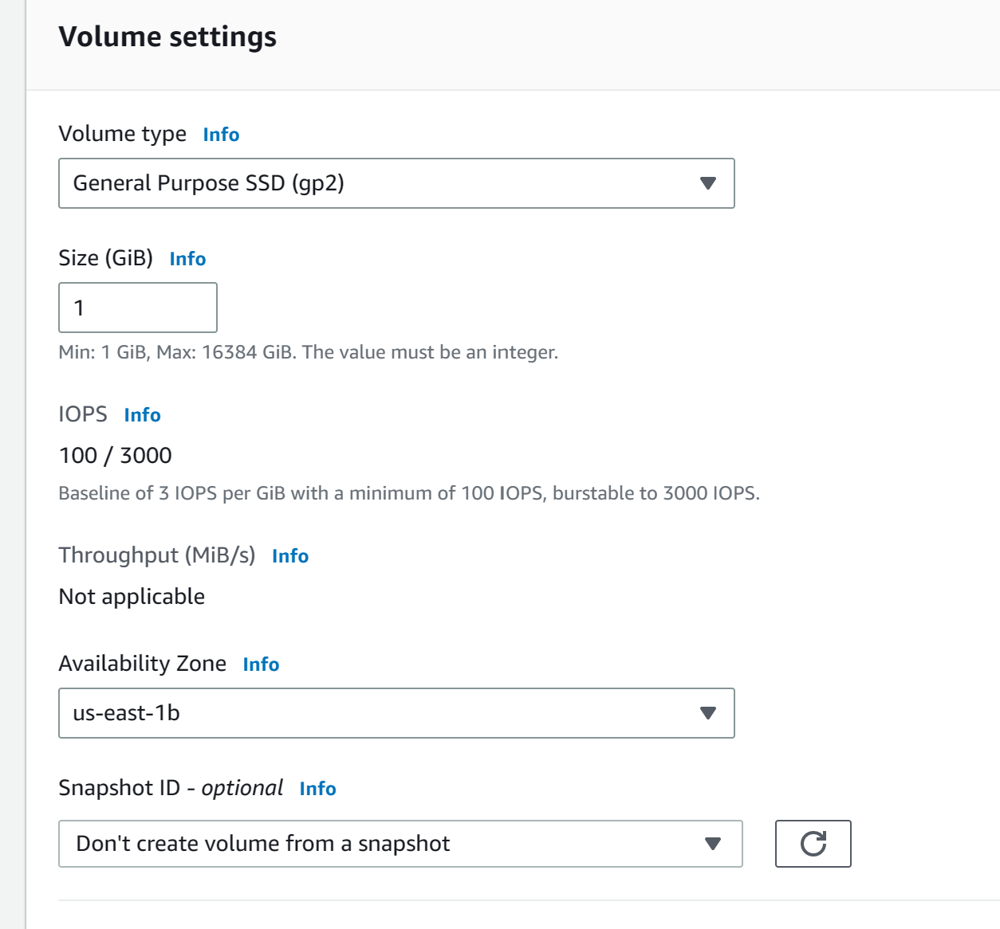

# EBS
    We are going to create EBS volume and mounting to instance.
    Step#1:
        Go to EBS and create volume
            select volume type `gp2` size `1GB`  and for AZ select `us-east-1a` . You can also chose snapshot  and Encrypt that volume using custom manage key or aws/ebs. But these are optional option.
        After EBS available we can attach this to our EC2.
    Step#2:
        Attach to instance
            Select EBS volume and click on action and `attach`.

    
    step#3
        Go to instance 1 in eu-west-1a
            - command need to use
               1: `lsblk` give list of all block
               2: To see if file system of our created blk use this command `sudo file -s /dev/xvdf` if return value is just data it mean it has not any file system. We have to create one.
               3:  file system for our /dev/xvdf use this command `sudo mkfs -t xfs /dev/xvdf`. Need to re confirm re-rerun previous number 2 command
               4:   create a directory to use this command `sudo mkdir /ebstest`
               5: For mount our file which we created to EBs volume need to use this command `sudo mount /dev/xvdf /ebstest`
               6: go created file using this command `cd /ebstest` and create one file `sudo nano amazingtestfile.txt` add some text line there. and save it
               7: To verify it use ls -al
               8: rebbot instance ` sudo reboot`

        step#4:
            After reboot connect same EC2 again
                1) verify still volume attach to that instnace use this command `df -k`
                    you will not see mount volume. After restart Ec2 instance it does not mount 
                2) For auto mount use this `sudo blkid` you will get unique identifier of all volume attach to that instance. Copy the id of volume which we created.
                3) Go to this file `sudo nano /etc/fstab`. This is configration file which show you which file is mount to our instance.
                4) in that file end UUID which we copied and folder where need to mount /ebstest  for example : `UUID=73664397-4a01-4699-8aaf-7a90bb530f8d  /ebstest xfs  defaults,nofail`
                5) use this command for mounting `sudo mount -a` it will mount all volume list in xfs file. and now use `do mount -a`
                6) move to our created `/ebstest` file use `/ebstest`  and use `ls -al`
                 to see file is there. This will show data is persistent. 

        step#5:
            stop instance 1. 
                1) Go to EBS volume and detach that volume . You will see your volume is available now. 
                2) After detach attach this EBS volume to instance number 2
                3) if you use `df -k` you will see volume is not mount to instance 2
                4) use `lsblk` give you list of all block device 
                5) use this command `sudo file -s /dev/xvdf` it will give you file system of ebs volume because we have set this one previously. 
                NOTe: we do not need to mount here because EBS volume is persistent
                6) make a directory `sudo mkdir /ebstest` and mount this directory `sudo mkdir /ebstest` got to that file using `ebstest` and you will see file over there using this command `ls -al`

            NTOE: So you can mount EBS volume to other instance using same AZ.
                7): Stop this instance number 2
        step#6:
            Now we are going to attach this EBS volume to other EC2 which is in different AZ
                1) create a sanpshot of EC2 instance
                2) create a volume from snapshot to different AZ
                3) Now  here we can change the Size and select AZ where you want to copy it. in our case is us-east-1b.
                
                4) attach our created snapshot volume to instance 
                5) use `lsblk` give you list of all block device 
                6) use this command `sudo file -s /dev/xvdf` it will give you file system of ebs volume because we have set this one previously. 
                NOTe: we do not need to mount here because EBS volume is persistent
                7) make a directory `sudo mkdir /ebstest` and mount this directory `sudo mkdir /ebstest` got to that file using `ebstest` and you will see file over there using this command `ls -al`

    # Commands User

## Instance 1

lsblk
sudo file -s /dev/xvdf
sudo mkfs -t xfs /dev/xvdf
sudo file -s /dev/xvdf
sudo mkdir /ebstest
sudo mount /dev/xvdf /ebstest
cd /ebstest
sudo nano amazingtestfile.txt
add a message
save and exit
ls -la

## Reboot Instance 1

sudo reboot

## Instance 1 After Reboot

df -k
sudo blkid
sudo nano /etc/fstab
  ADD LINE 
  UUID=YOURUUIDHEREREPLACEME  /ebstest  xfs  defaults,nofail
sudo mount -a
cd /ebstest
ls -la

## Instance 2

lsblk 
sudo file -s /dev/xvdf
sudo mkdir /ebstest
sudo mount /dev/xvdf /ebstest
cd /ebstest
ls -la

## Instance 3

lsblk 
sudo file -s /dev/xvdf
sudo mkdir /ebstest
sudo mount /dev/xvdf /ebstest
cd /ebstest
ls -la
