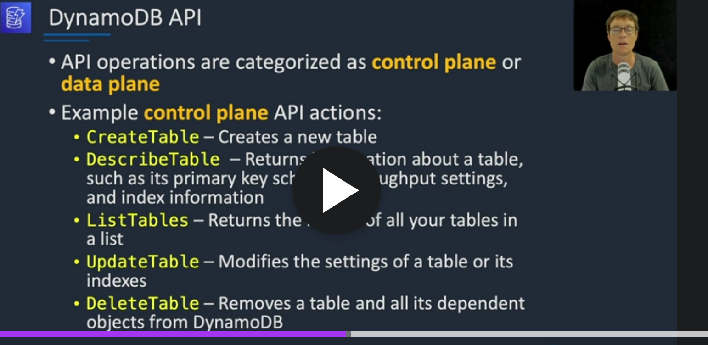
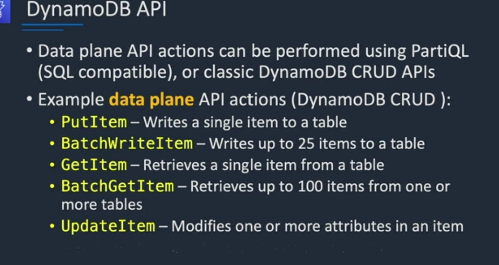
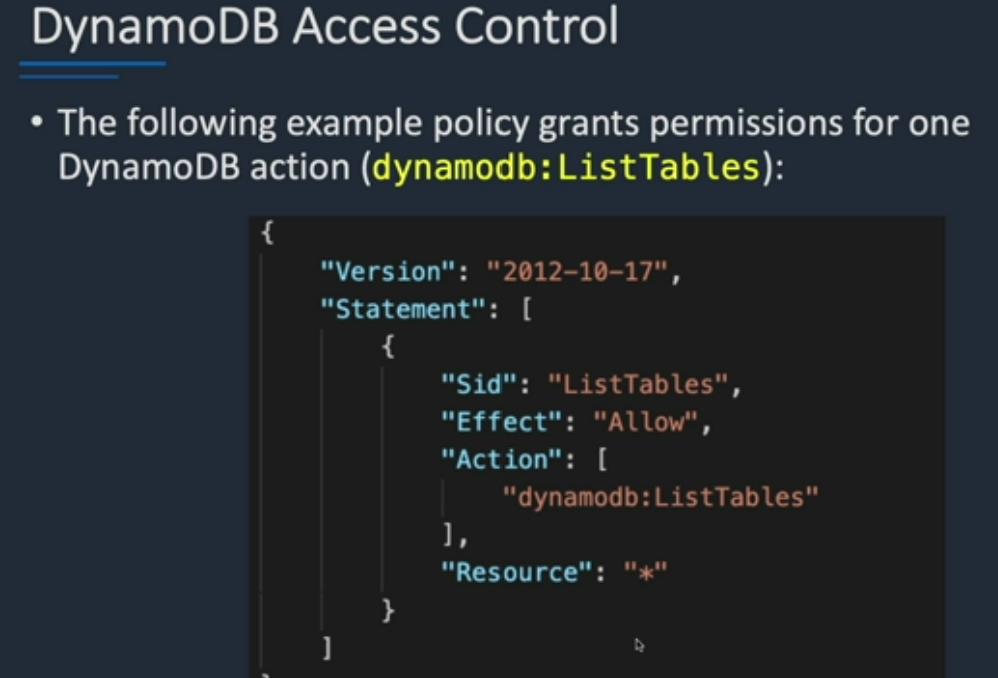

# DynamoDB:
    1 It is fully managed service
    2 key/ value store and document Store
    3 it is non relational , key /value store
    4 fully serverless service
    5 push button scaling
    6 DynamoDb provide low latency
    7 Micro second latency achieved by DynamoDB Accelrator (DAX)
    8 All data store in SSD
    9 DynamoDB Global table synchronize table across region
    10 Data is replicate across multi AZ in a region

# Supported Data Type:
    1) Scaler Type : represent one value like number, boolean , null
    2) Document Type: Represent complex structure like JSon 
    3) Set Type: Represent multiple scaler value like string, set

DynamoDB calsses:
    1   DynamoDB stander: 
        default and recomemded for most workload
    2 DynamoDB Stander Infrequent access 
        lower cost storage for table 

# DynamoDB Access control
    All authenticate and access control is managed by IAM
    NOTE:
        DynamoDB does not support resource base policy

