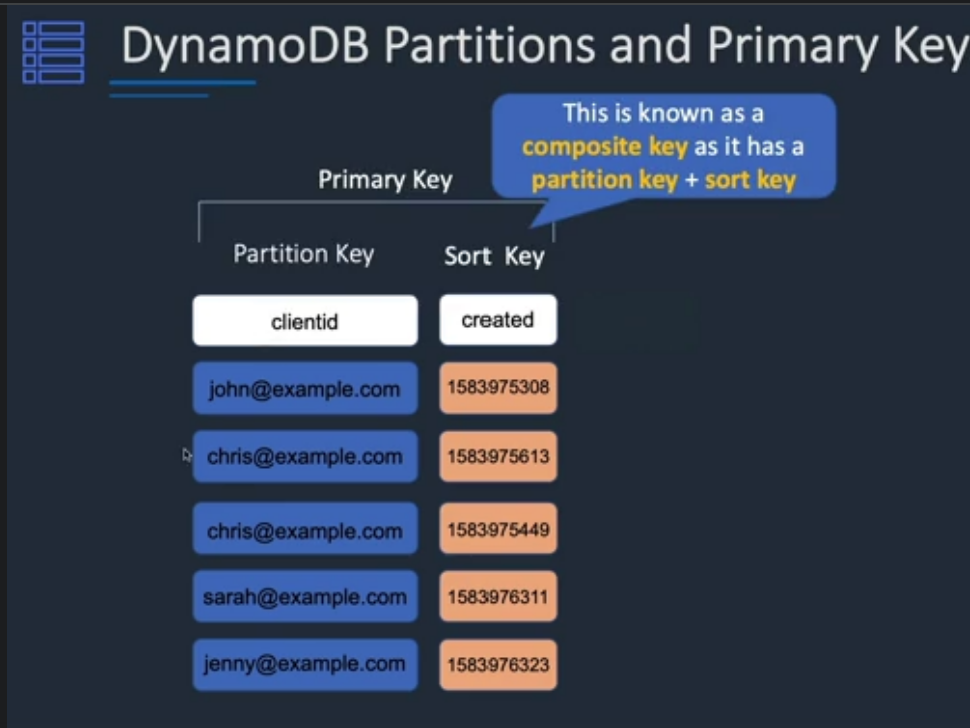

# DynamoDB partition
    1 dynamoDb store data in partition
    2 A partition is storage of table. that automatically replicate multiple AZ  within region
    3 DyanmoDB manage partition for your

# Primary key:
    There are two type of parition key
    1 parition key: Unique attribure (user ID)
            - Value of the partition key is input to internal hash function which determine partition or physical location on which data is stored.
            - If you are using partition key as a primary key then there is not two item have same primary key
    2 Composite key:
        Partition key + Sort Key in combination
        - 2 user have same partition key but they do not have same sort key
