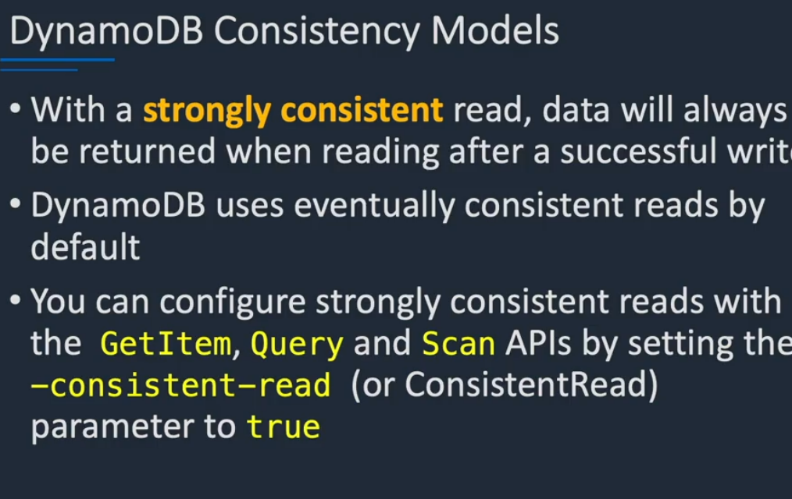
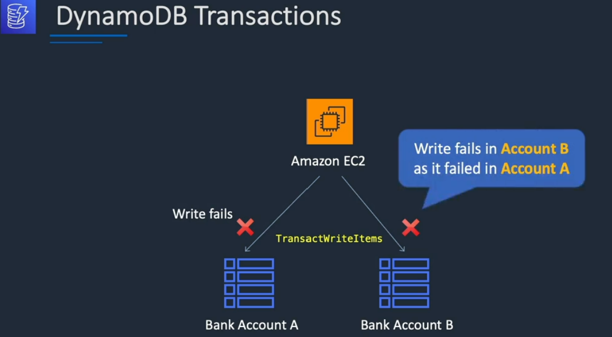

# DynamoDB consistency Model:
    DynamoDB support eventually consistent and strongly consistent read
    2 Eventually conssitent read:
        When you read data from DynamoDB table, the response might not reflect the recently complete operation
        
        2 Reponse might include some stale data
        3 If you repeat request after short time you will get latest data
    
    Consistenty Model 
        - DynamoDB return most up to date data , 
        - A strong consistent may not be available if there is network delay
            It return server error with 500 code
        
    You can set strongly consist read with `GetItem` , `Query`, `Scan` APi by setting - consisten-read to be true
    

# DynamoDB transection:
    with DynamoDB transection DynamoDB make cooridinate , all or nothing change to multiple item with in and across table
    2 it prodive automaticity , consistency and durability in DynamoDB. 
    3 Enable read and write multiple item across multiple table as an all or nothing operation

    Transection API:
        put, Delete, Update, conditionCheck

    you only pay read and write that part of your transection.
    

    If write item fail on account A then it will fail on account B. reason it is all or nothing change operation.  Mean if one fail all fail..