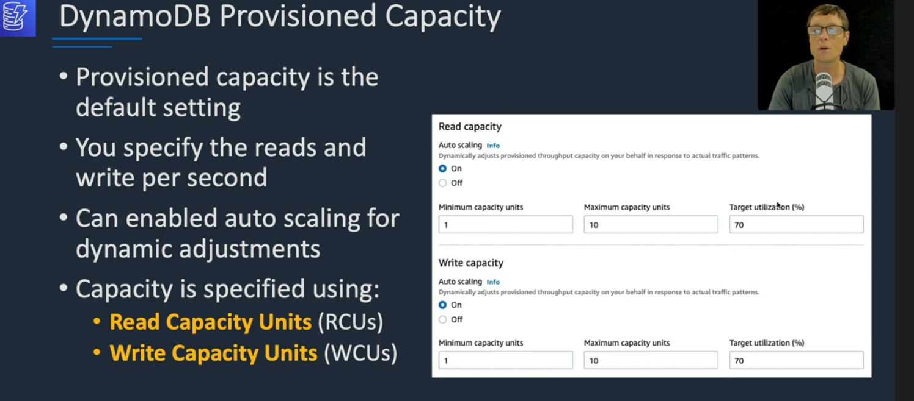
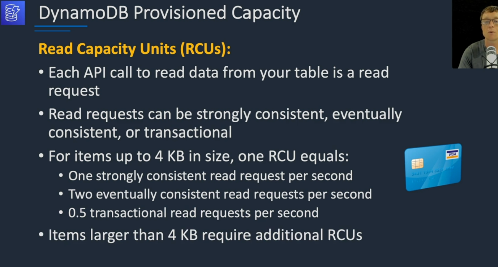
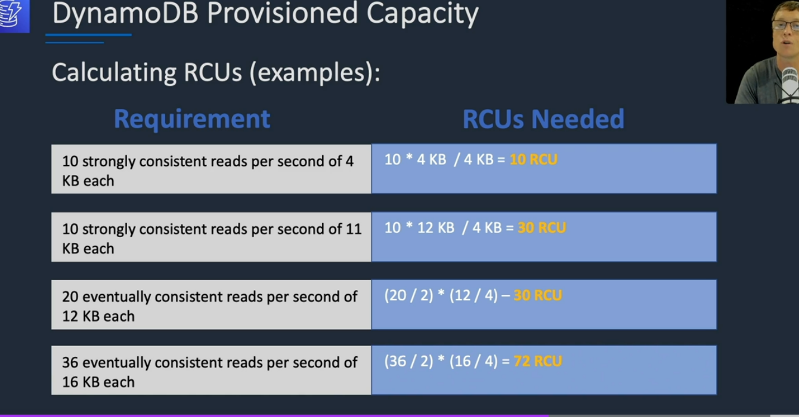
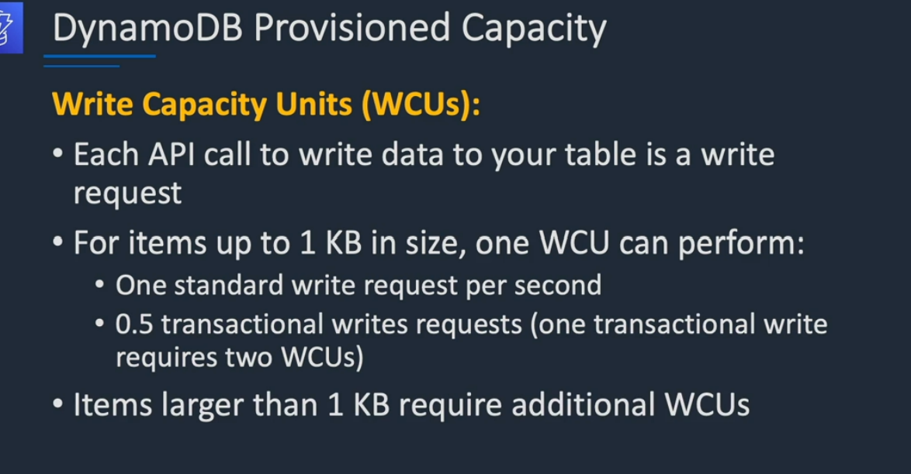
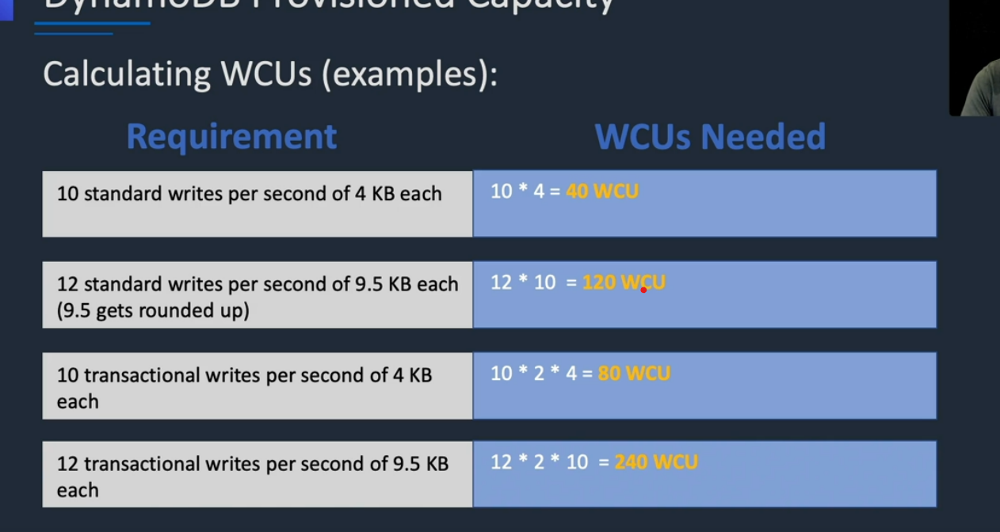

# Capacity unit
    
    
    
    
    

    If you do not want to use Provision capacity . You can use on-demand

    1 write on demand . you do not need to spacify requirments
    2 DynamoDB scale up or down base on activity on application
    3 great for unpredictable workload
    