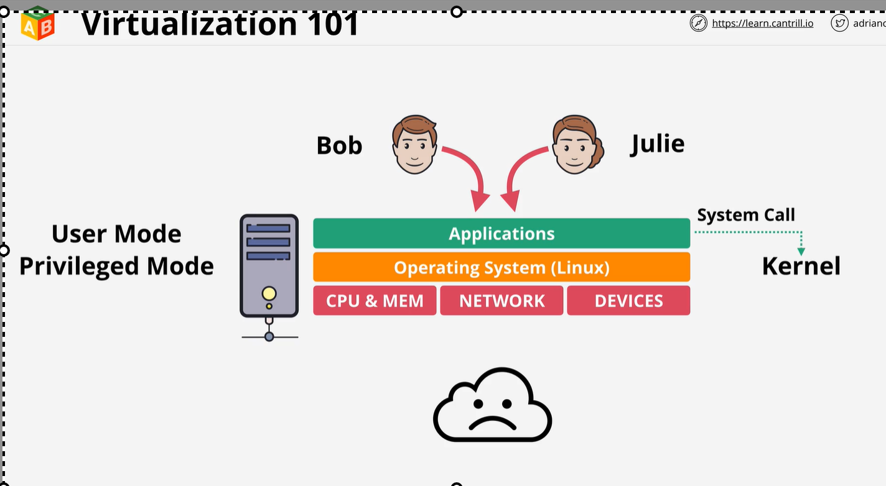

# Virtualization
    Origanliy before
    we have a machine which have attach CPU/ memory , NETWORK and DEVICES. Top of this we have Operating system running in previliged mode known as kernel.
    Top we OS we have application where software run.  

# In Virtualization:
    each OS is seperate and running seperate application. 

Need to study later
