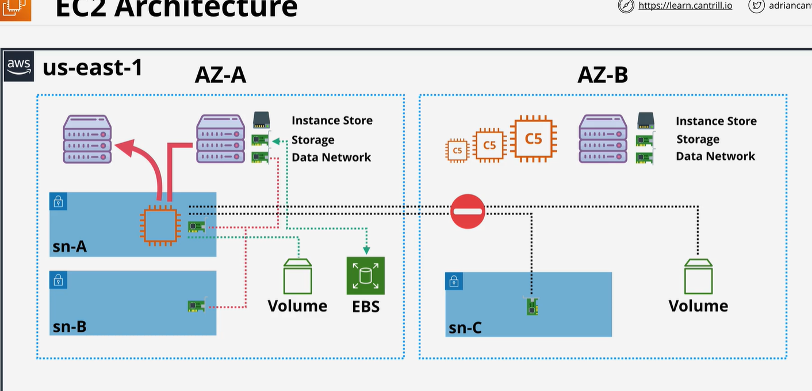

# Ec2
   1 Ec2 instnace is a virtual machine
   2 Ec2 instance run on Ec2 host
   3 shared host or dedicated host : you do not get individual access of hardware you pay what you use.
   In shared host you shared host with other user. But in dedicated host you are owner of all host. You do not have to share with other customer. 
   4  It is a resiliance to AZ. Host = 1AZ - AZ fail , Host fail, instance fail
   

   Ec2 have a local hardware like CPU, memory. but they also have some local storage called instance storage. Instance storage is temporary . If  instance running on perticulary host depend on type of instance it might be to utilize this instance store. If instance move from one to another one that storage will be lost. 
   They also have two type of networking
    1 storage networking
    2) data networking
    When instance is provisoned to specific subnet with in VPC. Then primary elastic network interface is proviossioned in a subnet which map to physical Ec2 host.  Remeber subnet also in one AZ. Instance can have multiple network interface even in different subnet as long as they are in same AZ.
    Ec2 host can connect to block storage which is known as EBS. EBS also run inside AZ. So service running in AZ-a is different running in AZ-b you can not access across. 
    Instance is running on specific host if restart the instance it will stay to the host.  Instance will stay on hsot untill 2 things happen 
    1 Host fail or is taken down maintenance by AWS
    2   if instance stopped and then restarted that is different then restart .  focusig on instance stopped and then start not just restart. 

    If above two thing happen then instance will relocated another host that host is also same AZ. Everything hardware , storage, memory , volume locked inside AZ.
    
    NOTE:
        Ec2 and EBS both AZ service. They are isolated you cannot cross AZ with instance or EBS volume. 

        Instance running on Ec2 host share that resource . instance different size can share a host. Mostly same type and generation instance occupy on same hsot. 

What Ec2 good for ?
1: when we are using tradiontional OS and compute need
2:  Long compute running. Ec2 is design for long running persistent requirment
3: It is also good for monolithic application like database, middleware, gitlab runner
4: It is also good for migrating application workload or Disaster recovery

