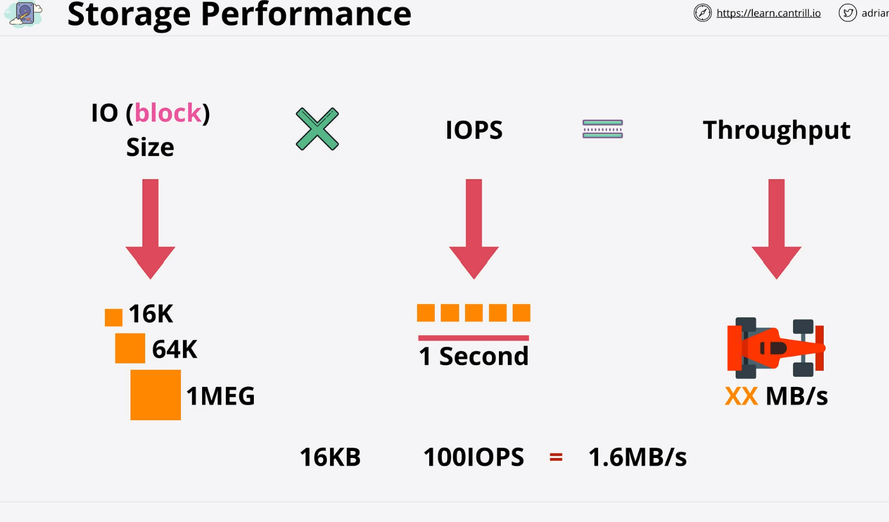

x# Storage Refresh
    1 Direct attach storage : Storage on Ec2 host (if disk fail, ec2 fail storage will lost)
    2 Network attach storage : Volume delivered over the network (EBS)
    3 Emphmeral storage: Temporary storage
    4 Persistent storage:   Permanent storage live on past the life time of instnace
    5 Block storage: Volume persistent to the OS as a collection of block,... It is Mountable and Bootable
    6 File storage: present as a file share ... has a structure . Mountable Not bootbale
    7 Object storage: It is collection of object Not Mountable Not bootable

    NOTE: 
        Most Ec2 use EBS volume as a Boot Volume
    

# Storage performance:
    IO size (block ) Think as a tyre of car. It is a size of block which you are writing or read to disk . 
    IOPS: Thinks as a speed of car
    Throughput: thins as a end speed result
    
