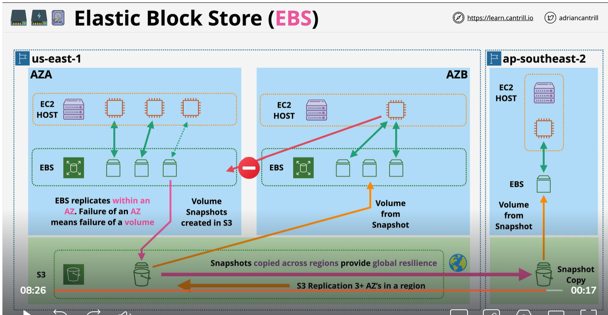

# EBS (Elastoc block storage)
    1) Block Storage     = raw disk allocation (volume). Can be encrypted using KMS.. Instance see the block device and create a file system on the device 
    2) Storage is provission in AZ . (Resilient in AZ). Mean one storage is different from other storage in different AZ, region.
    3) In EBS you create a volume and attach to one Ec2 over the storage internet.  You can detach or reattach to Ec2 instance. If instance move to different Ec2 host EBS volume follow it. If the instance start, restart or stopped EBS volume maintain.
    4) For the back of EBS you can create a snapshot and store into S3. Then you can migrage between different AZ. After store EBS snapshot in S3. So it is now region resilient. So it is can access to all AZ
    5)  EBS has different storage types, different size, different performance profile 
    6) Billed base on 1GB month (in some case on performance)
    7) After take sanphost and store into S3. You can share EBS volume to different Az or different region

EBS volume Type:
    For EBS type read onenote apps notes
    

# EBS Encryption
    Account can be set to encryption by default
    Otherwise choose KMS key to use
    Each volume has 1 DEK
    