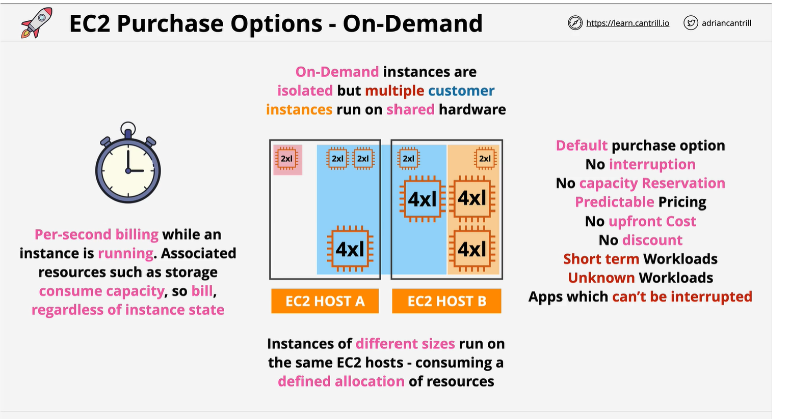
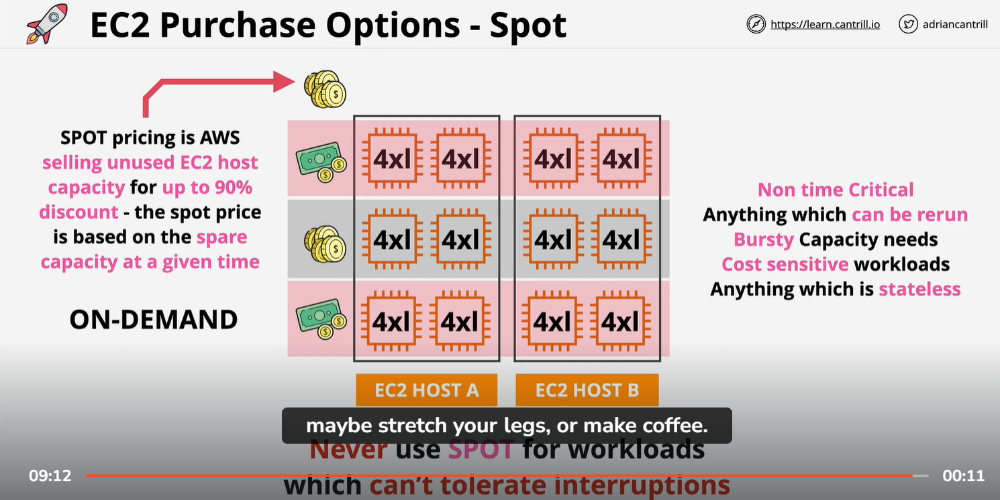
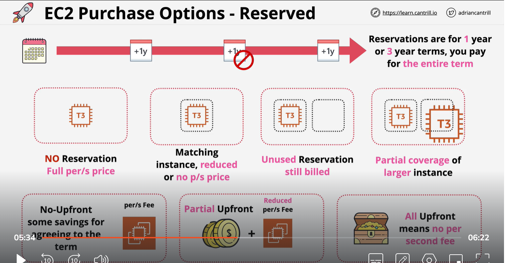
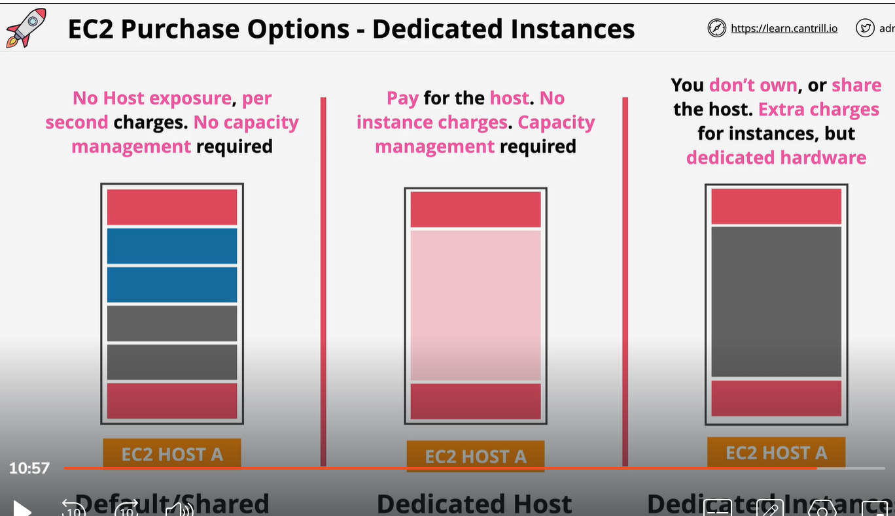
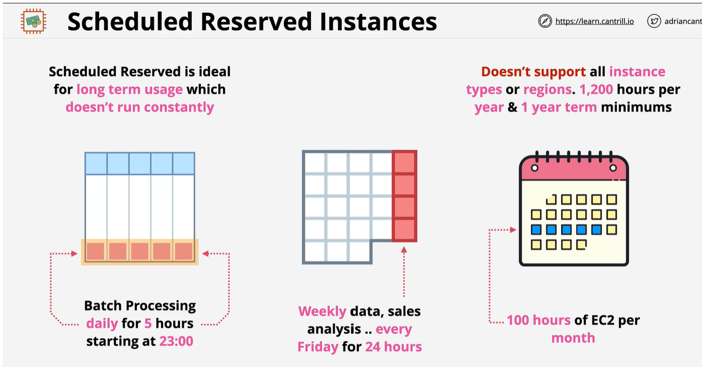

# Ec2 purchase option
    1) instance of different size run on same Ec2 host
    2) on demand instance are isolated but multiple customer instance run on shared hardware
    3) you have to pay per second when instance is running, if stop no need to pay
    4) It is good for 
        -   Default purchase option
        - No capacity reservation
        - No upfront cost
        - no discount 
        - shortterm workload
        - unknown workload

# Spot instance
    1 ) see in pic 2 instance is running per Ec2 Host. so space is available for more   4 Ec2 instance . It mean AWS can sell this space.
    2)  Spot price in AWS selling unused Ec2 host capacity for up 90% discount. 
    3) If the spot price go up on your Set price then your EC2 instance will be terminated
    4) Never use Spot for workload which can not tolerate interruptions

# Reserved instance:
    1) if you are using instance long term you can reserved it. it will reduce the price
    2) if you have unused reserve you have to pay them 
    3) Reserve is for 1 to 3 year , you pay for the entire term
    4) No upFront some saving  for aggreeing to the term

# Dedicated Hsot
    1) No instance charge , You have to pay for host
    Dedicatec Option:

    

# Schedule reserved instance
    1 Scheduled instance is a deal for long term usage which does not run constently
    2) Good for batch processing run daily at 5pm
    3) Weekly sale analysis
    4) Does not support on all the instnace types and region, 1200 hour per year and 1 term minumum

# capacity reservation
    1) In regional reservation you can get billing discount for valid instnace
    2) You also have zonal reservation , only apply to one AZ and you will get same billing discount like regional reservation.
    3) On demand reservation is book to ensure you always have a access to certain AZ. 

