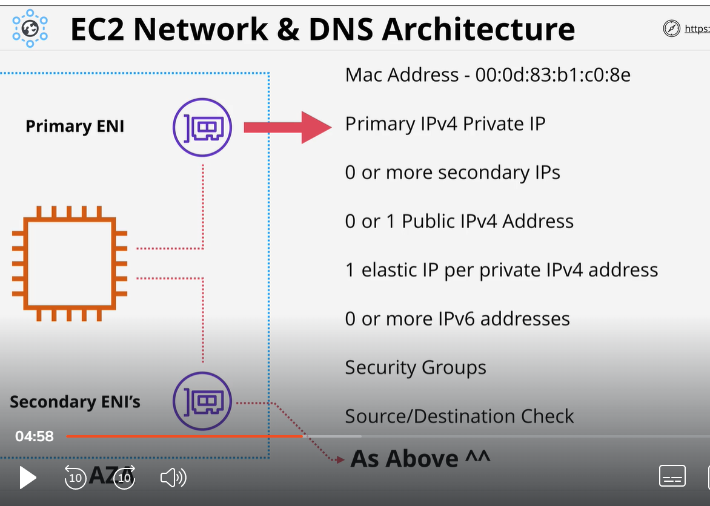
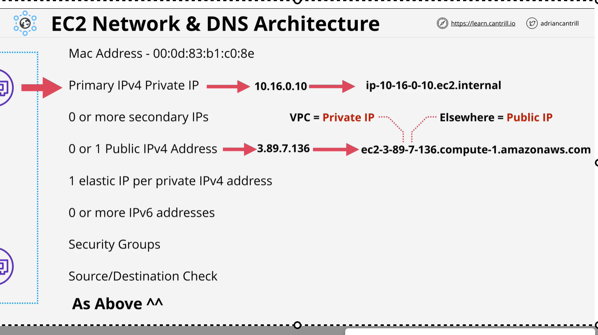

# ENI and DNS
    Every instance have ENI which is called primary ENI(Elastic Network Interface). ypu can also attach second ENI to instance. All of them in same AZ.
    
    NOTE: Instance belong to AZ. ENI can be in different subnet but subnet should be in same AZ where instance is located.

    Network interface have a mac address. Each Interface have a primary IPV4 privte IP address which is in range of subnet. you can also have 0 or more secondary IPV.
   You can have 0 or 1 public IPV4 address. 1 elastic IP per private IPV4 address.
   0 or more IPV6 IP address. security group applies to Network interface.  Per ENI you can enable or disable source/destination check.

NOTE:
When you stop or start the instance public IP will change.

If instance with in VPC then it replace with private IP.

Question come up in exam?
Can we get orignal IP if we remove elastic IP ?
    if your instance have public IP and you remove it and attach to elastic IP. Then reomve it you will not get previous (orignal)public IP

1) Secondary ENI + MAC = Licensing
2) Different security group = multiple interface
3) OS does not see public IPV4
4) IPV4 is Dynamic .. Stop and start change public IP
