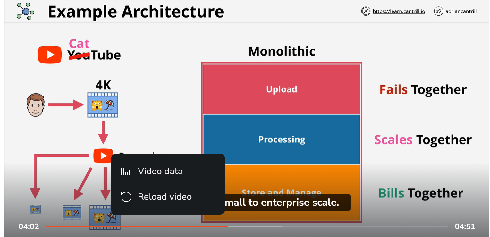
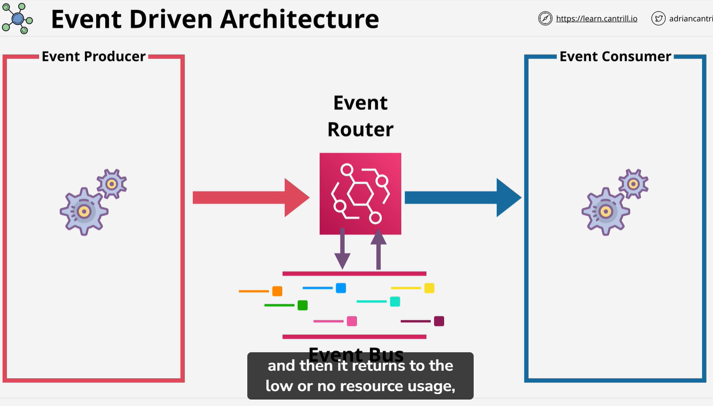

# Event architecture
    Monolithic architecture 

    Monolithic application scale vertically. mean If anything fail it will stop work. like if you see in pic if upload fail it stop work. Monolithic application would be least cost effective way to architect system.

In Enterpirse we broke monolithic architecture to different tier. we devide monolithic to different tier. In this each tier is connect to other tier It could be on same server or different server.
Tier archietct we can scale be verticaly scale individual.  we can add size of server, memory etc.

Now in advance . When bob upload video it store into s3 bucket and give relevent information to queue like size, So this point it upload video to s3 and addedd message to queue it finish perticuler trasection.  It does not exepect immediate answer from processing tier. The queue decoupled the upload and processing component. He use asynchronous communication. Where upload tier send the message it wait in background or just doing other thing while process tier done his job. In meanwhile more video it added into queue. Queue have a order called FIFO .
Other side of queue we have  a auto scaling group which have configure with min=0 , desire-0 and MAx=1337 . When desire is tough to 2 it start provision instnace. After provisen it start polling message from queue remember these message contain the data of job and they alos contain location of S3 bucket and location of object in that bucket.
 When job upload to instance it can get video from bucket and instance processing the job and delete from queue
 
 

 After complete the queue job may be auto scaling want to go back because desire capacity go down.

# Micro service arhictecture:

# Event driven arhchitecture:

    It is a software which produce event in reaction of something. like if customer click submit it might be a event. 
    Thing to remember Event producer and Event consumer they are not waiting to thing to happen . 
    like when button pressed it produce event and consume is not waiting for event. mean they do not consume resource.
        
        # Event Router/ Event bus
            constently flow of infermation. When event generate by producer it add into event bus. the route deliver this to consumer. 
    Event driven only consume resource when it required. if more resource come up it scale up .when they solve it go back down. 

# Event driven
1) No contently running or waiting
2) producer generate thing when something happen
3)  Event are deliver to consumer
