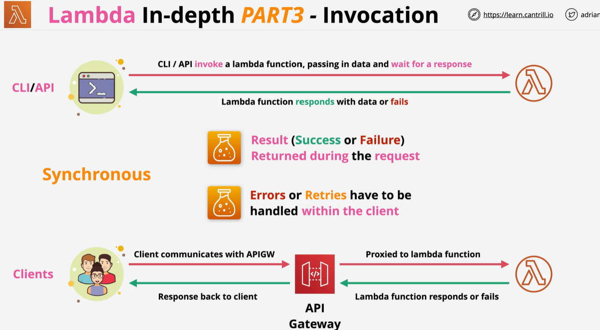

# Lambda part 1:
    1 Function as a service. short running and focussed
    2 Lambda function : it is piece of code 
    3 function use runtime : like python ,node , java
    4 Function loaded into run time enviourment. 
    5 The run time enviourment has direct memory allocation : certain amount of CPU is allocated, 
    6 You will get bill only for duration of running function.

    Lambda is a deployment package . When lambda function invoke it download package into the environment..

    For security for lambda control by execuation role these are IAM role. which provide permession of service which lambda can use.  

    NOTE:
        lambda execuation time is 15 mintue

By default lambda given by public networking. They can access public AWS services and public internet. 

Lambda within VPC:
    If lambda is deploy within VPC private subnet which have other resources, like EC2 , database lambda can access it . But it can not access anything outside that VPC unless VPc has configration set.
    In this architecture lambda can not access dynamoDB or public internet.
    To access DynamoDB you can set gateway endpoint and for accessing public internet you can define NAT gateway in public subnet.
    You also need to create Ec2 permession IAM role. Because lambda need to create network interface

# Lambda Loggin:
    1) Lambda use cloudwatch, Cloudwatch log and xray
    2) Log from lambda execuation, cloudWatch log
    3) Metric , invocation success/failure , store in cloudwatch
    4) Cloudwatch log require permession via Execuation role

Lambda invocation:
    we have two invocation 
    1 asynchronous invocation
    2 synchronous invocation
    
    1 synchronous invocation
        In synchoronous invocation client has to wait for response. response will be fill or ok. If fail and client want to see more detail he has to run function again.

    2 Asynchronous invocation
        Idepotent: mean you run function any time output will be same.

# Event source Mapping third type:
    Typically used on stream or queue which do not event generation to invke lambda(SQS, Kineses, DynamoDB)

# Lambda version:
    1) Lambda function has a version like v1, v2, v2
    2) A version  is a code + configration of lambda function
    3) It is immutbale  it never cahnge once publish has own it on Amazon Resource name
    4) $Latest point to latest function
    5) Alias (DEV,PROD,TEST) point a version can be change

