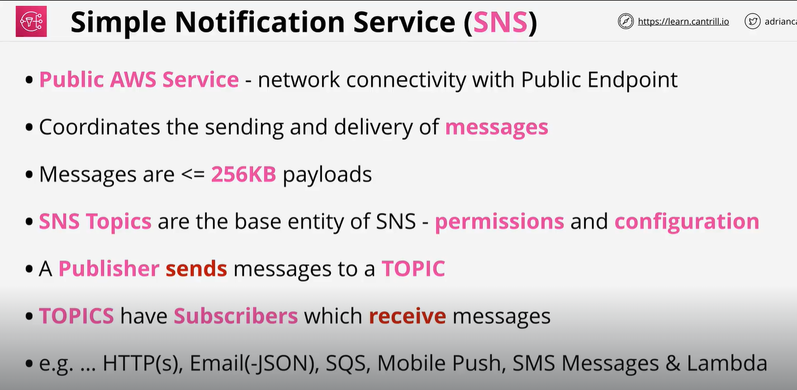

# Simple notificaton service (SNS)
The Simple Notification Service or SNS .. is a PUB SUB style notification system which is used within AWS products and services but can also form an essential part of serverless, event-driven and traditional application architectures.

Publishers send messages to TOPICS

Subscribers receive messages SENT to TOPICS.

    1) Public AWS service , network connectivity with public Endpoint
    2) Cooridinate the sending and  devlivery message
    3) Message 356kb (killo byte)   payload
    4) SNS topic is base entity of SNS - Permession and configration
    5) Publisher send message to the topic
    6) Topic have subscriber which recieve message
        ) Different subscriber like, HTTP, EMAIL, SQS, mobile phone, Lambda

we use SNS to send notification e.g cloud watch or CloudFormation

Explanation:
    See one NOTE Docupling one

# SQS (simple Queue service)
        See one NOTE Docupling one

