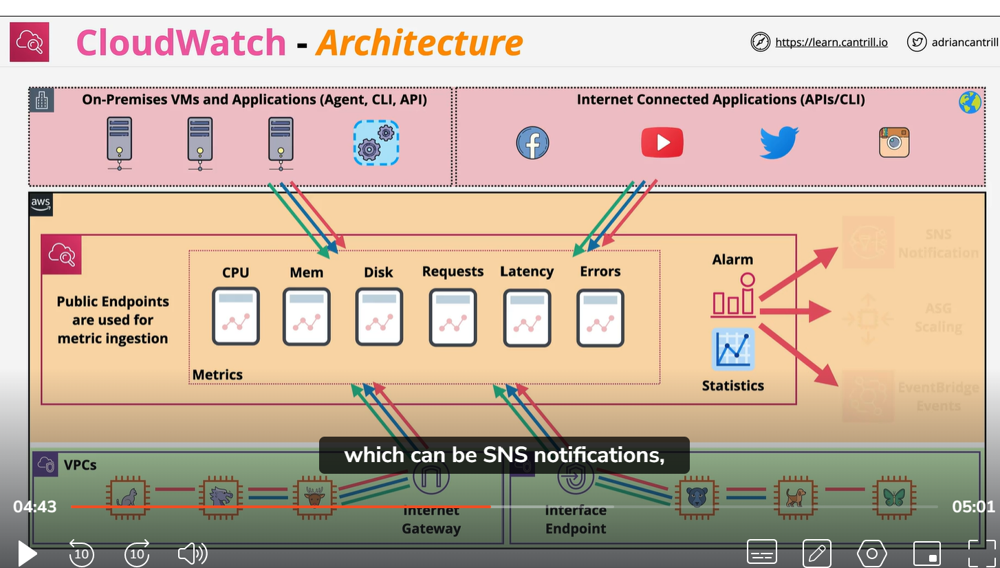

# CloudWatch
1) managment of metric and storage
2) public sapce , public endpoint
3) On premise integration via API
4) Application integration via API/ agent
5) View data via console, CLI, API, dashboard
6) you can set alarm on metric

# Cloudwatch architecture

    we have a AWS zone with  yellow with public and green with private vpc. On premise in red. Cloud watch stay in public zone. it store metric like memory, CPU, disk etc
    various service publish data into cloud watch like on-premise virtual machine and application , And at the bottom servies in VPC publish data into clodWatch using commbination of public IP address and internet gateway which allow to connect to cloudwatch using IPv4 or IPv6.  or alternative private VPC can connect to cloudwatch but this time they use `interface endpoint`. Then at the end we can create alaram. 

# Cloudwatch data
    - Namespace - AWS/EC2 or AWS/ECS etc
    - Datapoint - timestamp, value, 
    - Ec2 metric like `CPUUtilization`, `NetworkIn`, `DiskWriteByte`
    - It has key and value pair e.g CPUUtilization  NAME=InstanceId value =i-123123
    

# see oneNOte app notes

