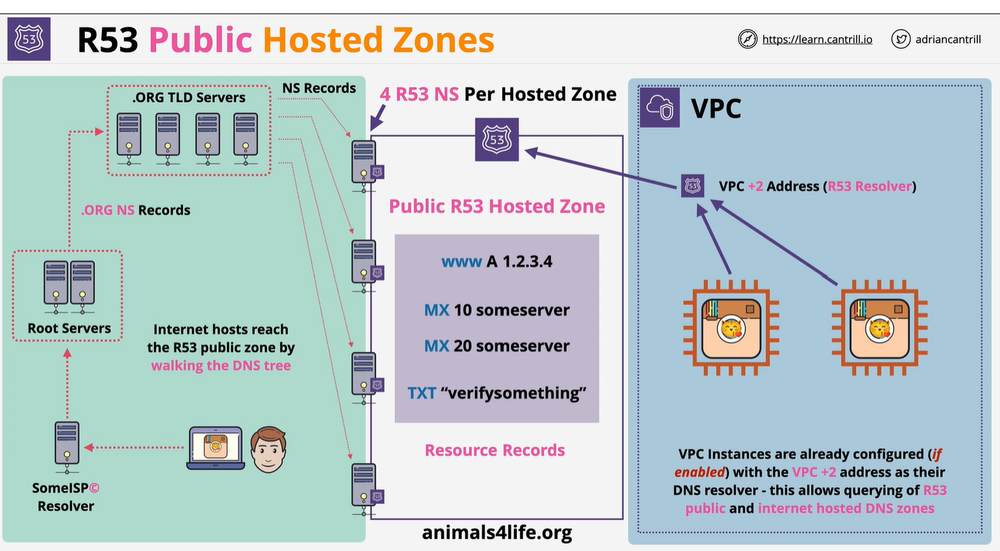

# Public Hosted Zone
    - A Route53 is DNS DB for domain
    - It is a global service
    - Created with Domain register Route53-  can be created seperately
    - Host DNS record 

    - DNS database (zone file) vie route 53.
    - Access from public internet and VPC
    - 

Creating 4NS per hosted zone. which all access by public internet. It also aceess with AWS VPC using route53 resolver. Inside Hosted zone we can create record.  In VPC access method is direct. VPC +2 address(R53 resolver). VPC Instance are already confirged with VPC +2 address as DNS resolver. This allow query to R53 public and Internet hosted zone. 
For public internet DNS start with DNS root server. Root server have infermation about .org 

