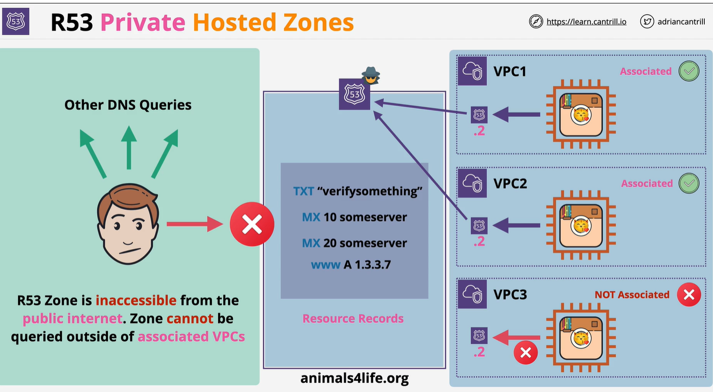

# Private Hosted Zone
    - It is similer public Hosted zone. But not publix
    - It is associated with VPC
    - 

    Public internet can not access our hosted zone. But in private we have 2 VPC which have instance and R53 resolver. Any VPC which we associated with private zone will be able to access R53 private zone vis R53 resolver. 

# Route53 Split view Hosted zone:
    Imagine we have a running workspace in VPC and Route 53 is associate with that VPC so workspace can use that private zone. Public internet can not access the private zone.
   But split view hosted zone do is to create public zone with same name. This public hosted zone have a record which might private VPC has. Now you can access the public hosted zone.
 